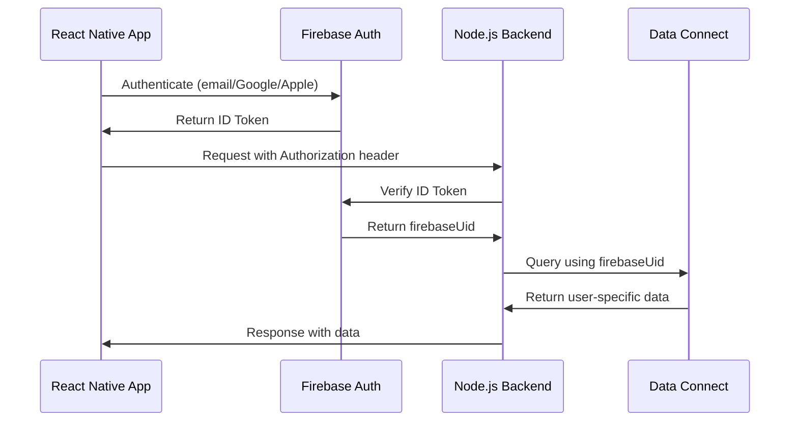

# Firebase Data Connect - Requerimientos del Proyecto Skillix

## Tabla de Contenidos
- [10.1 Estructura del Proyecto](#101-estructura-del-proyecto)
- [10.2 Estructuras JSON Generadas por LLM](#102-estructuras-json-generadas-por-llm)
- [10.3 Entidades de Datos Centrales y Relaciones](#103-entidades-de-datos-centrales-y-relaciones)
- [10.4 Consultas/Mutaciones de Muestra](#104-consultasmutaciones-de-muestra)
- [10.5 Flujo de Autenticación](#105-flujo-de-autenticación)
- [10.6 Base de Datos Existente](#106-base-de-datos-existente)
- [10.7 Preocupaciones y Desafíos](#107-preocupaciones-y-desafíos)

---

## **10.1. Estructura del Proyecto**

### Árbol de Directorios Actual

```
skillix-backend/
├── src/
│   ├── config/
│   │   └── index.ts                      # Configuración general
│   ├── services/
│   │   ├── llm/                          # Servicios de LLM centralizados
│   │   │   ├── analytics.service.ts      # Análisis de patrones de usuario
│   │   │   ├── chatOrchestrator.service.ts
│   │   │   ├── contentGenerator.service.ts
│   │   │   ├── learningPlanner.service.ts
│   │   │   ├── notifications.service.ts
│   │   │   ├── pedagogicalExpert.service.ts
│   │   │   ├── schemas.ts                # Schemas Zod centralizados
│   │   │   ├── skillAnalyzer.service.ts
│   │   │   ├── toviTheFox.service.ts     # Mascota AI
│   │   │   ├── openai.service.ts
│   │   │   ├── prompts.ts
│   │   │   └── index.ts
│   │   └── dataConnect.service.ts        # (A crear para Firebase Data Connect)
│   ├── controllers/                      # (A crear)
│   ├── middleware/                       # (A crear)
│   └── app.ts                           # Aplicación principal
├── dataconnect/                         # (A crear para Firebase Data Connect)
│   ├── schema/
│   ├── connectors/
│   └── dataconnect.yaml
├── package.json
└── README.md
```

### Recomendación para Integración

**Ubicación de `dataconnect`**: En la raíz del proyecto, paralelo a `src/`, para mantener separación clara entre lógica de negocio y esquema de datos.

---

## **10.2. Estructuras JSON Generadas por LLM**

### **Ejemplo 1: Entidad Principal - Plan de Aprendizaje**

```typescript
// De LearningPlanSchema
{
  "total_duration_weeks": 4,
  "daily_time_minutes": 15,
  "skill_level_target": "beginner",
  "milestones": [
    "Complete basic Python syntax",
    "Build first simple program",
    "Understand variables and data types"
  ],
  "daily_activities": [
    {
      "type": "focused_reading",
      "duration_minutes": 8,
      "description": "Read about Python fundamentals"
    },
    {
      "type": "interactive_quiz",
      "duration_minutes": 7,
      "description": "Practice syntax with quizzes"
    }
  ],
  "resources": [
    {
      "name": "Python Official Documentation",
      "url": "https://docs.python.org/3/"
    }
  ],
  "progress_metrics": [
    "Completion of daily tasks",
    "Quiz scores > 80%"
  ],
  "flexibility_options": [
    "Designated catch-up day per week",
    "Optional deep-dive topics"
  ]
}
```

**Descripción**: Entidad central que define la estructura completa de un plan de aprendizaje personalizado generado por LLM.

### **Ejemplo 2: Entidad con Relaciones Simples - Contenido Diario**

```typescript
// De DayContentSchema
{
  "title": "Python Variables and Data Types",
  "is_action_day": false,
  "objectives": [
    "Understand variable assignment",
    "Learn about string, int, float types",
    "Practice variable naming conventions"
  ],
  "main_content": {
    "type": "read",
    "title": "Understanding Python Variables",
    "content": "Variables in Python are like containers...",
    "estimated_time": 5,
    "fun_fact": "Python was named after Monty Python!",
    "key_concepts": [
      {
        "term": "variable",
        "definition": "A named location in memory that stores data"
      }
    ],
    "xp": 20
  },
  "exercises": [
    {
      "type": "quiz_mcq",
      "question": "Which is a valid variable name?",
      "options": ["my_var", "2var", "var-name", "var name"],
      "answer": 0,
      "explanation": "Variable names must start with a letter or underscore",
      "xp": 20
    }
  ],
  "action_task": null,
  "total_xp": 60,
  "estimated_time": "15 minutes"
}
```

**Descripción**: Contenido específico de un día que pertenece a un `LearningPlan`, con ejercicios interactivos.

### **Ejemplo 3: Entidad con Relaciones Complejas - Análisis de Usuario**

```typescript
// De UserAnalyticsSchema
{
  "learning_patterns": [
    {
      "pattern_type": "time_based",
      "description": "User consistently learns in the morning between 8-10 AM",
      "confidence": 0.85,
      "recommendations": [
        "Schedule notifications for 7:45 AM",
        "Optimize content for morning energy levels"
      ]
    },
    {
      "pattern_type": "content_preference",
      "description": "Prefers audio content over reading",
      "confidence": 0.72,
      "recommendations": [
        "Prioritize audio-based lessons",
        "Convert key reading materials to audio"
      ]
    }
  ],
  "optimal_learning_time": {
    "best_time_window_start": "08:00",
    "best_time_window_end": "10:00",
    "reason": "Highest completion rates and quiz scores observed",
    "notification_time": "07:45",
    "engagement_prediction": 0.87
  },
  "content_optimization": {
    "difficulty_adjustment": "maintain",
    "content_type_preferences": ["audio", "interactive_exercise", "quiz_mcq"],
    "ideal_session_length_minutes": 12,
    "pacing_recommendation": "Current pace is optimal, maintain consistency"
  },
  "streak_maintenance_analysis": {
    "risk_level": "low",
    "risk_factors": ["Upcoming weekend"],
    "intervention_strategies": [
      "Send gentle reminder on Friday evening",
      "Suggest shorter weekend sessions"
    ],
    "motivational_approach": "Celebratory and positive"
  },
  "overall_engagement_score": 0.78,
  "key_insights": [
    "Strong morning learner with audio preference",
    "Maintains consistent 7-day streaks",
    "Responds well to quiz-based content"
  ]
}
```

**Descripción**: Análisis complejo que agrega múltiples patrones de comportamiento y conecta con estrategias de contenido y notificaciones.

---

## **10.3. Entidades de Datos Centrales y Relaciones**

### **Entidades Principales**

1. **User** - Usuarios de la plataforma
2. **LearningPlan** - Planes de aprendizaje personalizados
3. **DayContent** - Contenido diario específico
4. **UserProgress** - Progreso del usuario
5. **SkillAnalysis** - Análisis de habilidades
6. **UserAnalytics** - Analytics y patrones de aprendizaje
7. **Notification** - Notificaciones personalizadas
8. **StreakData** - Datos de rachas de aprendizaje
9. **Quiz/Exercise** - Ejercicios y cuestionarios
10. **SkiMessage** - Mensajes de la mascota AI

### **Relaciones Clave**

```
User (1) ←→ (1) UserAnalytics
User (1) ←→ (many) LearningPlan
User (1) ←→ (many) UserProgress
User (1) ←→ (1) StreakData
User (1) ←→ (many) Notification

LearningPlan (1) ←→ (many) DayContent
LearningPlan (1) ←→ (1) SkillAnalysis

DayContent (1) ←→ (many) Exercise
DayContent (1) ←→ (many) UserProgress

UserAnalytics (1) ←→ (many) LearningPattern
UserAnalytics (1) ←→ (1) OptimalLearningTime
```

### **Tipos de Datos con Enumeraciones**

- **UserExperienceLevel**: `"beginner" | "intermediate" | "advanced"`
- **ContentBlockType**: `"audio" | "read" | "quiz_mcq" | "quiz_truefalse" | "match_meaning" | "scenario_quiz"`
- **DifficultyAdjustment**: `"increase" | "maintain" | "decrease"`
- **RiskLevel**: `"low" | "medium" | "high"`
- **PatternType**: `"time_based" | "performance_based" | "engagement_based" | "content_preference" | "other"`

---

## **10.4. Consultas/Mutaciones de Muestra**

### **Consultas Comunes de Recuperación de Datos**

#### 1. **"Obtener plan de aprendizaje activo del usuario"**
```graphql
query GetUserActivePlan($userId: String!) {
  user(firebaseUid: $userId) {
    activeLearningPlan {
      totalDurationWeeks
      currentDay
      dailyTimeMinutes
      dayContents {
        title
        isActionDay
        objectives
      }
    }
  }
}
```

#### 2. **"Obtener contenido del día específico"**
```graphql
query GetDayContent($planId: String!, $dayNumber: Int!) {
  dayContent(planId: $planId, dayNumber: $dayNumber) {
    title
    mainContent
    exercises
    totalXp
    estimatedTime
  }
}
```

#### 3. **"Obtener analytics del usuario"**
```graphql
query GetUserAnalytics($userId: String!) {
  userAnalytics(userId: $userId) {
    overallEngagementScore
    optimalLearningTime
    keyInsights
    streakMaintenanceAnalysis
  }
}
```

#### 4. **"Obtener progreso del usuario"**
```graphql
query GetUserProgress($userId: String!) {
  userProgress(userId: $userId) {
    currentStreak
    totalXp
    completedDays
    averageQuizScore
  }
}
```

#### 5. **"Obtener mensajes de Ski personalizados"**
```graphql
query GetSkiMessages($userId: String!, $situation: String!) {
  skiMessage(userId: $userId, situation: $situation) {
    message
    emojiStyle
    animationSuggestion
  }
}
```

### **Mutaciones Comunes de Modificación de Datos**

#### 1. **"Crear plan de aprendizaje personalizado"**
```graphql
mutation CreateLearningPlan($input: LearningPlanInput!) {
  createLearningPlan(input: $input) {
    id
    totalDurationWeeks
    skillLevelTarget
    milestones
  }
}
```

#### 2. **"Completar día de aprendizaje"**
```graphql
mutation CompleteDayContent($userId: String!, $dayContentId: String!, $results: DayResultsInput!) {
  completeDayContent(userId: $userId, dayContentId: $dayContentId, results: $results) {
    xpEarned
    newStreak
    isStreakMilestone
  }
}
```

#### 3. **"Actualizar analytics del usuario"**
```graphql
mutation UpdateUserAnalytics($userId: String!, $analyticsData: UserAnalyticsInput!) {
  updateUserAnalytics(userId: $userId, data: $analyticsData) {
    overallEngagementScore
    updatedPatterns
  }
}
```

---

## **10.5. Flujo de Autenticación**

### **Configuración Actual/Planeada**

- **Frontend (React Native)**: Firebase Authentication con múltiples proveedores
  - Email/Password
  - Google Sign-In
  - Apple Sign-In (iOS)
- **Backend (Node.js)**: 
  - Verificación de tokens Firebase ID mediante `firebase-admin`
  - Middleware de autenticación que extrae `firebaseUid` de tokens
  - Creación automática de perfil de usuario en primera autenticación

### **Flujo de Autenticación**



### **Pasos del Flujo**

1. Usuario se autentica en React Native → Firebase Auth
2. Firebase devuelve ID Token
3. Frontend envía requests con token en Authorization header
4. Backend verifica token con firebase-admin
5. Extrae firebaseUid y lo usa como identificador principal
6. Data Connect queries usan firebaseUid para filtrar datos del usuario

---

## **10.6. Base de Datos Existente**

### **Estado Actual**

No hay base de datos PostgreSQL existente. El proyecto está en desarrollo inicial y los datos se almacenan actualmente en:
- Estructuras en memoria durante desarrollo
- Archivos JSON temporales para testing
- Respuestas de LLM almacenadas temporalmente

### **Migración Planeada**

- **Implementación nueva** con Firebase Data Connect desde cero
- Los **schemas Zod existentes** servirán como base para los esquemas GraphQL
- **No hay necesidad de migración** de datos existentes
- Transición gradual desde almacenamiento temporal a persistencia real

---

## **10.7. Preocupaciones y Desafíos**

### **1. Mapeo de Schemas Complejos**

**Problema**: Los schemas Zod tienen validaciones complejas
```typescript
// Ejemplo de validación compleja en DayContentSchema
.refine(data => {
  if (data.is_action_day) {
    return data.main_content === null; 
  } else { 
    return data.main_content !== null && data.action_task === null;
  }
}, {
  message: "Structural inconsistency for DayContent..."
});
```

**Desafío**: Cómo traducir estas validaciones a GraphQL/PostgreSQL constraints.

### **2. Consultas Analíticas Complejas**

**Problema**: `UserAnalytics` requiere agregaciones complejas
- Cálculo de patrones de aprendizaje en tiempo real
- Análisis de comportamiento de múltiples fuentes de datos
- Predicciones basadas en histórico

**Desafío**: Diseñar consultas eficientes que no impacten performance.

### **3. Escalabilidad de Notificaciones**

**Problema**: Sistema de notificaciones personalizadas basado en `OptimalLearningTime`
- Scheduling de notificaciones para miles de usuarios
- Diferentes zonas horarias
- Personalización basada en analytics individuales

**Desafío**: Implementar sistema eficiente de scheduling con Data Connect.

### **4. Consistencia de Datos LLM**

**Problema**: Garantizar que estructuras JSON generadas por LLM sean válidas
- LLMs pueden generar JSON que no cumple exactamente el schema
- Necesidad de validación robusta antes de persistir
- Manejo de errores cuando LLM falla

**Desafío**: Balance entre flexibilidad de LLM y rigidez de schema de BD.

### **5. Rendimiento de Consultas Educativas**

**Problema**: Queries complejas para recomendaciones adaptativas
- Consultas que cruzan múltiples entidades (User → Analytics → Content)
- Tiempo real para recomendaciones de contenido
- Agregaciones para dashboards de progreso

**Desafío**: Optimización de consultas y posible necesidad de cache/indexing.

### **6. Sincronización Frontend-Backend**

**Problema**: Mantenimiento de tipos TypeScript sincronizados
- Schemas GraphQL deben coincidir con tipos TypeScript
- Cambios en esquemas deben propagarse automáticamente
- Validación en tiempo de compilación

**Desafío**: Setup de generación automática de tipos desde schemas de Data Connect.

### **Prioridades para Implementación**

1. **Fase 1**: Entidades básicas (User, LearningPlan, DayContent)
2. **Fase 2**: Sistema de analytics y progreso
3. **Fase 3**: Notificaciones y optimizaciones
4. **Fase 4**: Features avanzadas y escalabilidad

---

## **Siguientes Pasos**

1. Crear estructura base de `dataconnect/`
2. Definir esquemas GraphQL principales
3. Implementar connectors básicos
4. Integrar con servicios LLM existentes
5. Testing y optimización

¿Te gustaría que profundice en alguna de estas áreas específicas o que comience con la implementación de algún aspecto particular? 