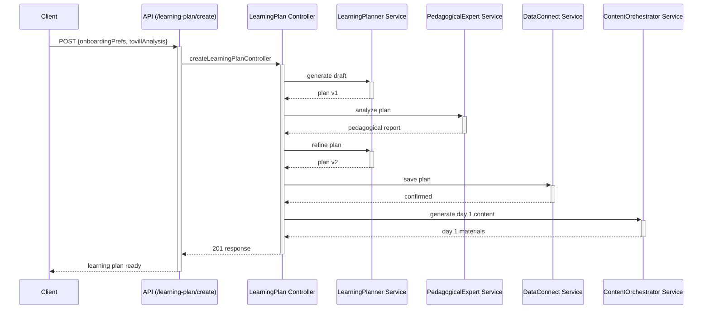

# Tovi Backend 🦊

Welcome to the backend powering **Tovi**, the AI driven microlearning platform. This repository contains a TypeScript & Node.js REST API that orchestrates multiple LLM agents and persists data through Firebase Data Connect.

## Quick start

```bash
pnpm install
cp .env.example .env       # fill in the real values
pnpm dev                   # start the API on http://localhost:8080
```

## Overview

The backend is built with **Node.js**, **Express** and **TypeScript**. It is responsible for:

- Handling authentication and user profiles.
- Orchestrating several **LLM agents** to create personalized learning experiences.
- Interacting with **Firebase Data Connect** to store data securely.
- Exposing a RESTful API consumed by the mobile and web clients.

---

## Local development

Local work typically uses **four terminals** running in parallel:

### Prerequisites

```bash
# 1. install dependencies
pnpm install

# 2. set environment variables
cp .env.example .env
# edit .env with your real values

# 3. install Firebase CLI
npm install -g firebase-tools

# 4. authenticate
firebase login
```

### Terminal 1: Firebase emulators

```bash
firebase emulators:start --project=skillix-db
```
Starts the Auth and Data Connect emulators.

### Terminal 2: Express backend

```bash
pnpm dev
```
Starts the development server on port `8080`.

### Terminal 3: Metro bundler (React Native)

```bash
cd skillix
pnpm start
```
Runs Metro on port `8081`.

### Terminal 4: React Native app

```bash
cd skillix
pnpm ios     # or pnpm android
```
Builds and launches the mobile app.

### Useful URLs

- Backend API: <http://localhost:8080>
- Firebase Auth emulator: <http://localhost:9099>
- Firebase Data Connect emulator: <http://localhost:9399>
- Metro bundler: <http://localhost:8081>

### Quick check

```bash
curl http://localhost:8080/api/health
```
Should return `"OK"`.

---

## Deploying to Google Cloud Run

The project can be deployed manually, with Docker or via Cloud Build.
Below are the main steps for a first deployment.

### Requirements

```bash
# Install gcloud CLI
# macOS
brew install google-cloud-sdk
# Windows/Linux: https://cloud.google.com/sdk/docs/install

# Authenticate
gcloud auth login
gcloud auth application-default login

# Select project
gcloud config set project YOUR_PROJECT_ID

# Enable APIs
gcloud services enable cloudbuild.googleapis.com
gcloud services enable run.googleapis.com
gcloud services enable sqladmin.googleapis.com
```

### Environment variables

```bash
gcloud run services update skillix-backend \
  --region=us-central1 \
  --set-env-vars="NODE_ENV=production" \
  --set-env-vars="PORT=8080" \
  --set-env-vars="FIREBASE_PROJECT_ID=skillix-db" \
  --set-env-vars="OPENAI_API_KEY=your-openai-api-key" \
  --set-env-vars="OPENAI_MODEL=gpt-4o-mini" \
  --set-env-vars="DATA_CONNECT_SERVICE_ID=skillix-db-service" \
  --set-env-vars="DATA_CONNECT_LOCATION=us-central1"
```

### Service account

```bash
# Create
gcloud iam service-accounts create skillix-backend-sa \
  --display-name="Skillix Backend Service Account"

# Assign roles
gcloud projects add-iam-policy-binding YOUR_PROJECT_ID \
  --member="serviceAccount:skillix-backend-sa@YOUR_PROJECT_ID.iam.gserviceaccount.com" \
  --role="roles/dataconnect.serviceAgent"

gcloud projects add-iam-policy-binding YOUR_PROJECT_ID \
  --member="serviceAccount:skillix-backend-sa@YOUR_PROJECT_ID.iam.gserviceaccount.com" \
  --role="roles/firebase.admin"

# Create JSON key
gcloud iam service-accounts keys create ./serviceAccountKey.json \
  --iam-account=skillix-backend-sa@YOUR_PROJECT_ID.iam.gserviceaccount.com

# Upload as secret
gcloud secrets create firebase-service-account-key \
  --data-file=./serviceAccountKey.json
```

### Deployment methods

- **Manual**: `gcloud run deploy skillix-backend --source . --region=us-central1 --allow-unauthenticated`
- **Docker**: build and push an image then deploy with `--image`
- **Cloud Build**: `gcloud builds submit --config cloudbuild.yaml .`

### Updating variables

```bash
gcloud run services update skillix-backend \
  --region=us-central1 \
  --set-env-vars="NEW_VAR=value"
```

### Logs and metrics

```bash
SERVICE_URL=$(gcloud run services describe skillix-backend --region=us-central1 --format="value(status.url)")
curl "$SERVICE_URL/api/health"
gcloud run services logs tail skillix-backend --region=us-central1
```

---

## Architecture

The system follows a layered service pattern:

`API routes` → `Middleware (Auth)` → `Controller` → `Service / Orchestrator` → `LLM Agent` → `DataConnect Service`

Each LLM agent is a small service with a specific system prompt. The **Data Connect Service** is the only layer allowed to access the database.

### Learning Plan flow



---

## Testing Strategy

The project uses a **comprehensive multi-layer testing approach** designed for both rapid development and thorough validation. Our testing architecture is optimized for different environments including **OpenAI Codex** compatibility.

### 🏗️ **Testing Architecture**

```
tests/
├── services/     📱 Individual unit tests (No server required)
├── api/          🌐 API integration tests (Server + Firebase required)
├── flows/        🔄 End-to-end flow validation (No server required)
├── simulators/   🎯 Complete simulation demos (No server required)
├── cli/          ⚡ Interactive performance tools (No server required)
└── helpers/      🛠️ Testing utilities
```

### 📱 **Individual Service Tests** (`tests/services/`)

**Purpose:** Unit tests for services with specific individual logic that don't integrate with the main learning flow simulation.

**Infrastructure:** No server required ✅ | **Time:** ~1 second | **OpenAI Codex:** ✅ Compatible

**Services tested:**
- **`openai.service.spec.ts`** - OpenAI API communication layer and error handling
- **`chatOrchestrator.service.spec.ts`** - Real-time chat with context and history management
- **`toviTheFox.service.spec.ts`** - Ski the Fox motivational messages and celebrations
- **`notifications.service.spec.ts`** - Push notification system for reminders and achievements

**When to use:**
```bash
# Quick validation during service development
pnpm test:services

# Debug specific service issues
pnpm test:services -- --testNamePattern="ChatOrchestrator"

# Watch mode for rapid iteration
pnpm test:services -- --watch
```

### 🌐 **API Integration Tests** (`tests/api/`)

**Purpose:** Full HTTP endpoint validation with complete infrastructure stack.

**Infrastructure:** Firebase emulators + PostgreSQL + Express server ⚠️ | **Time:** ~15 seconds | **OpenAI Codex:** ❌ Not compatible

**Endpoints tested:**
- **`auth.spec.ts`** - Authentication flows and user profile synchronization
- **`onboarding.spec.ts`** - Skill analysis and user onboarding process
- **`learningPlan.spec.ts`** - Learning plan creation and management
- **`content.spec.ts`** - Daily content generation and delivery
- **`user.spec.ts`** - User stats, streaks, and XP management

**When to use:**
```bash
# Full API validation (starts infrastructure automatically)
pnpm test:e2e

# Complete system validation (offline + API)
pnpm test:all
```

### 🔄 **Flow Integration Tests** (`tests/flows/`)

**Purpose:** End-to-end learning journey validation using the simulation system.

**Infrastructure:** No server required ✅ | **Time:** ~1 second | **OpenAI Codex:** ✅ Compatible

**Flows tested:**
- **`complete-learning-journey.flow.spec.ts`** - Complete journey simulation from skill analysis to content generation
- Journey validation for 1-100 day learning plans
- Action Day logic validation (every 3rd day)
- XP accumulation and progression verification
- Multi-skill scenario testing
- Edge cases and robustness validation

**When to use:**
```bash
# Validate end-to-end journey integration
pnpm test:flows

# Debug journey flow issues
pnpm test:flows -- --verbose
```

### 🎯 **Simulation System Tests** (`tests/simulators/`)

**Purpose:** Comprehensive testing of the simulation system itself with detailed demos.

**Infrastructure:** No server required ✅ | **Time:** ~1.5 seconds | **OpenAI Codex:** ✅ Compatible

**Components:**
- **`demo-simulation.spec.ts`** - Complete simulation demos with detailed logging
- **`service-simulators.ts`** - Jest-compatible simulation engine
- **`standalone-simulator.ts`** - CLI-compatible simulation engine

**Simulation coverage:**
- Journey simulation from skill analysis → plan creation → content generation
- Performance testing with multiple concurrent journeys
- Edge case validation (long skill names, very short/long journeys)
- Content structure and XP validation
- Ski message generation and variety

**When to use:**
```bash
# Test simulation system functionality
pnpm test:simulators

# See detailed demo with logging
pnpm test:simulators -- --verbose
```

### ⚡ **CLI Performance Tools** (`tests/cli/`)

**Purpose:** Interactive tools for journey simulation and performance analysis.

**Infrastructure:** No server required ✅ | **Time:** Variable | **OpenAI Codex:** ✅ Compatible

**Tools available:**
- **`simulate-user-journey.ts`** - Interactive journey simulation with rich output
- **`performance-test.ts`** - Comprehensive performance testing with metrics

**When to use:**
```bash
# Interactive journey simulation
pnpm sim:journey --skill "Python" --days 7 --detailed
pnpm sim:journey --skill "React" --days 3 --export "react-journey.json"

# Performance analysis
pnpm sim:performance --iterations 20 --concurrency 5
pnpm sim:performance --skill "JavaScript" --days 10 --export "perf-results.json"
```

### 📜 **Complete Script Reference**

#### **Development Scripts** (Fast feedback, no infrastructure)
```bash
# Individual service testing
pnpm test:services          # Only service unit tests (~1s)
pnpm test:flows             # Only end-to-end flow tests (~1s)
pnpm test:simulators        # Only simulation system tests (~1.5s)
pnpm test:offline           # All offline tests combined (~1s)

# Interactive simulation
pnpm sim:journey            # Journey simulation tool
pnpm sim:performance        # Performance analysis tool
```

#### **Integration Scripts** (Full infrastructure required)
```bash
# Infrastructure management
pnpm start:test             # Start Express server for testing
pnpm migrate:schema         # Database schema migration

# API testing
pnpm test:e2e              # API tests with Firebase + PostgreSQL + Express (~15s)
pnpm test:all              # Complete validation: offline + e2e (~16s)
```

### 🎯 **OpenAI Codex Compatibility Matrix**

| Script | Infrastructure | Networking | Codex Compatible | Use Case |
|--------|----------------|------------|------------------|----------|
| `test:services` | None | None | ✅ Yes | Service debugging |
| `test:flows` | None | None | ✅ Yes | Journey validation |
| `test:simulators` | None | None | ✅ Yes | Simulation testing |
| `test:offline` | None | None | ✅ Yes | **Primary development** |
| `sim:journey` | None | None | ✅ Yes | Interactive testing |
| `sim:performance` | None | None | ✅ Yes | Performance analysis |
| `test:e2e` | Firebase + Express | HTTP | ❌ No | API validation |
| `test:all` | Firebase + Express | HTTP | ❌ No | Complete validation |

### 🚀 **Development Workflow**

#### **Daily Development** (OpenAI Codex compatible)
```bash
# Primary development workflow - super fast feedback
pnpm test:offline           # Complete offline validation

# Specific debugging
pnpm test:services          # Debug individual services
pnpm test:flows            # Debug journey integration
pnpm sim:journey           # Interactive journey testing
```

#### **Feature Validation** (Local environment)
```bash
# Complete system validation
pnpm test:all              # Offline + API tests

# Performance verification
pnpm sim:performance       # Analyze system performance
```

#### **Pre-deployment** (CI/CD pipeline)
```bash
# Complete validation pipeline
pnpm test:offline          # Fast offline validation
pnpm test:e2e             # Infrastructure-dependent validation
pnpm migrate:schema        # Database schema updates
```

### 🎯 **Benefits of This Architecture**

**🏃‍♂️ Speed & Efficiency:**
- Offline tests: ~1 second for complete validation
- No OpenAI API costs during development
- Instant feedback for most development tasks

**🎯 Comprehensive Coverage:**
- Unit tests for individual service logic
- Integration tests for complete journey flows
- API tests for HTTP contract validation
- Performance tests for scalability verification

**🔄 Environment Flexibility:**
- OpenAI Codex: 80% of tests work without networking
- Local development: Complete testing suite
- CI/CD: Automated validation pipeline

**🧠 Developer Experience:**
- Interactive tools for exploration
- Detailed simulation with rich logging
- Performance analysis with actionable insights
- Clear separation between fast/slow tests