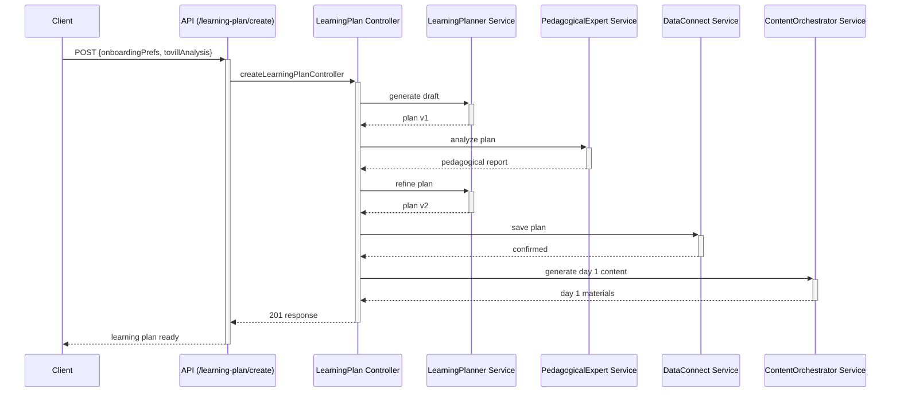

# Tovi Backend 🦊

Welcome to the backend powering **Tovi**, the AI driven microlearning platform. This repository contains a TypeScript & Node.js REST API that orchestrates multiple LLM agents and persists data through Firebase Data Connect.

## Quick start

```bash
pnpm install
cp .env.example .env       # fill in the real values
pnpm dev                   # start the API on http://localhost:8080
```

## Overview

The backend is built with **Node.js**, **Express** and **TypeScript**. It is responsible for:

- Handling authentication and user profiles.
- Orchestrating several **LLM agents** to create personalized learning experiences.
- Interacting with **Firebase Data Connect** to store data securely.
- Exposing a RESTful API consumed by the mobile and web clients.

---

## Local development

Local work typically uses **four terminals** running in parallel:

### Prerequisites

```bash
# 1. install dependencies
pnpm install

# 2. set environment variables
cp .env.example .env
# edit .env with your real values

# 3. install Firebase CLI
npm install -g firebase-tools

# 4. authenticate
firebase login
```

### Terminal 1: Firebase emulators

```bash
firebase emulators:start --project=skillix-db
```
Starts the Auth and Data Connect emulators.

### Terminal 2: Express backend

```bash
pnpm dev
```
Starts the development server on port `8080`.

### Terminal 3: Metro bundler (React Native)

```bash
cd skillix
pnpm start
```
Runs Metro on port `8081`.

### Terminal 4: React Native app

```bash
cd skillix
pnpm ios     # or pnpm android
```
Builds and launches the mobile app.

### Useful URLs

- Backend API: <http://localhost:8080>
- Firebase Auth emulator: <http://localhost:9099>
- Firebase Data Connect emulator: <http://localhost:9399>
- Metro bundler: <http://localhost:8081>

### Quick check

```bash
curl http://localhost:8080/api/health
```
Should return `"OK"`.

---

## Deploying to Google Cloud Run

The project can be deployed manually, with Docker or via Cloud Build.
Below are the main steps for a first deployment.

### Requirements

```bash
# Install gcloud CLI
# macOS
brew install google-cloud-sdk
# Windows/Linux: https://cloud.google.com/sdk/docs/install

# Authenticate
gcloud auth login
gcloud auth application-default login

# Select project
gcloud config set project YOUR_PROJECT_ID

# Enable APIs
gcloud services enable cloudbuild.googleapis.com
gcloud services enable run.googleapis.com
gcloud services enable sqladmin.googleapis.com
```

### Environment variables

```bash
gcloud run services update skillix-backend \
  --region=us-central1 \
  --set-env-vars="NODE_ENV=production" \
  --set-env-vars="PORT=8080" \
  --set-env-vars="FIREBASE_PROJECT_ID=skillix-db" \
  --set-env-vars="OPENAI_API_KEY=your-openai-api-key" \
  --set-env-vars="OPENAI_MODEL=gpt-4o-mini" \
  --set-env-vars="DATA_CONNECT_SERVICE_ID=skillix-db-service" \
  --set-env-vars="DATA_CONNECT_LOCATION=us-central1"
```

### Service account

```bash
# Create
gcloud iam service-accounts create skillix-backend-sa \
  --display-name="Skillix Backend Service Account"

# Assign roles
gcloud projects add-iam-policy-binding YOUR_PROJECT_ID \
  --member="serviceAccount:skillix-backend-sa@YOUR_PROJECT_ID.iam.gserviceaccount.com" \
  --role="roles/dataconnect.serviceAgent"

gcloud projects add-iam-policy-binding YOUR_PROJECT_ID \
  --member="serviceAccount:skillix-backend-sa@YOUR_PROJECT_ID.iam.gserviceaccount.com" \
  --role="roles/firebase.admin"

# Create JSON key
gcloud iam service-accounts keys create ./serviceAccountKey.json \
  --iam-account=skillix-backend-sa@YOUR_PROJECT_ID.iam.gserviceaccount.com

# Upload as secret
gcloud secrets create firebase-service-account-key \
  --data-file=./serviceAccountKey.json
```

### Deployment methods

- **Manual**: `gcloud run deploy skillix-backend --source . --region=us-central1 --allow-unauthenticated`
- **Docker**: build and push an image then deploy with `--image`
- **Cloud Build**: `gcloud builds submit --config cloudbuild.yaml .`

### Updating variables

```bash
gcloud run services update skillix-backend \
  --region=us-central1 \
  --set-env-vars="NEW_VAR=value"
```

### Logs and metrics

```bash
SERVICE_URL=$(gcloud run services describe skillix-backend --region=us-central1 --format="value(status.url)")
curl "$SERVICE_URL/api/health"
gcloud run services logs tail skillix-backend --region=us-central1
```

---

## Architecture

The system follows a layered service pattern:

`API routes` → `Middleware (Auth)` → `Controller` → `Service / Orchestrator` → `LLM Agent` → `DataConnect Service`

Each LLM agent is a small service with a specific system prompt. The **Data Connect Service** is the only layer allowed to access the database.

### Learning Plan flow

