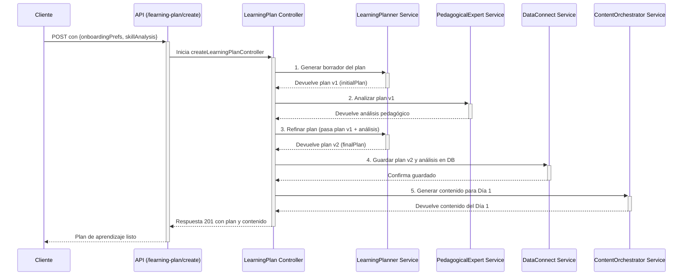

# Tovi Backend 🦊

Bienvenido al backend de Tovi, la plataforma de microlearning impulsada por IA. Este documento sirve como una guía completa de la arquitectura, los flujos de datos y, lo más importante, el paso a paso para configurar y probar el sistema.

---

## Índice

1.  [Filosofía y Arquitectura Clave](#filosofía-y-arquitectura-clave)
2.  [Primeros Pasos](#primeros-pasos)
3.  [Scripts del Proyecto (package.json)](#scripts-del-proyecto-packagejson)
4.  [Ciclo de Desarrollo y Pruebas (La Guía Definitiva)](#ciclo-de-desarrollo-y-pruebas-la-guía-definitiva)
5.  [Estructura del Proyecto](#estructura-del-proyecto)
6.  [Flujo Detallado: Creación de un Plan de Aprendizaje](#flujo-detallado-creación-de-un-plan-de-aprendizaje)
7.  [Solución de Problemas Comunes](#solución-de-problemas-comunes)
8.  [Descripción de la API](#descripción-de-la-api)

---

## Filosofía y Arquitectura Clave

El backend de Tovi está diseñado en torno a dos principios fundamentales:

1.  **Orquestación de Agentes LLM**: En lugar de depender de un único LLM monolítico, el sistema utiliza un conjunto de **agentes de IA especializados** (ubicados en `src/services/llm/`). Cada agente tiene una única responsabilidad (analizar una habilidad, planificar, generar contenido, etc.), lo que permite un mayor control, calidad y facilidad de depuración.
2.  **Robustez frente a la IA (Validación con Zod)**: La interacción con los LLM es inherentemente impredecible. Para proteger el sistema de respuestas malformadas, todas las salidas de los LLM pasan por una **rigurosa capa de validación y transformación** usando la librería **Zod** (`src/services/llm/schemas.ts`). Esto garantiza que solo datos limpios, validados y con el formato correcto entren en nuestra lógica de negocio y base de datos.

## Primeros Pasos

Para poner en marcha el proyecto, sigue estos pasos:

1.  **Clonar el repositorio:**
    ```bash
    git clone <URL_DEL_REPOSITORIO>
    cd Tovi-backend
    ```

2.  **Instalar dependencias:**
    Usamos `pnpm` como gestor de paquetes.
    ```bash
    pnpm install
    ```

3.  **Configurar variables de entorno:**
    -   Copia el archivo de ejemplo `.env.example` a un nuevo archivo llamado `.env`.
    -   Rellena todas las variables requeridas, especialmente `OPENAI_API_KEY`.
    -   Asegúrate de tener el archivo `serviceAccountKey.json` de Firebase en `src/config/`.

4.  **Iniciar el entorno de desarrollo:**
    Sigue las instrucciones en la sección [Ciclo de Desarrollo y Pruebas](#ciclo-de-desarrollo-y-pruebas-la-guía-definitiva).

## Scripts del Proyecto (package.json)

Aquí tienes una explicación de los scripts que usarás con más frecuencia:

-   `pnpm dev`: **(Uso principal)** Inicia el servidor en modo de desarrollo usando `nodemon`. Recargará automáticamente el servidor cada vez que hagas un cambio en el código fuente.
-   `pnpm test`: Ejecuta el conjunto de pruebas End-to-End (E2E) usando Jest. **Importante**: Requiere que el servidor y los emuladores ya estén corriendo (ver ciclo de desarrollo).
-   `pnpm test:e2e`: **(Uso principal para pruebas)** Este es el comando "todo en uno" para las pruebas. Inicia los emuladores de Firebase, ejecuta todas las pruebas (`test:run`) y luego apaga los emuladores automáticamente. Es la forma más fiable de asegurar un entorno de pruebas limpio.
-   `pnpm test:migrate`: Ejecuta las migraciones del esquema de Data Connect en el emulador local. Úsalo **solo cuando hagas cambios** en los archivos `*.gql` dentro del directorio `dataconnect/`.
-   `pnpm build`: Transpila el código de TypeScript a JavaScript y lo guarda en el directorio `dist/`. Necesario para producción.
-   `pnpm start`: Ejecuta la versión de producción del backend desde el directorio `dist/`.
-   `pnpm lint` / `pnpm lint:fix`: Analiza el código en busca de errores de estilo y los corrige automáticamente.

## Ciclo de Desarrollo y Pruebas (La Guía Definitiva)

Este es el flujo de trabajo recomendado para desarrollar y probar la aplicación de manera eficiente y sin errores.

### Paso 0: Migración del Esquema (Poco frecuente)

Haz esto **SOLO si has modificado el esquema de GraphQL** en `dataconnect/schema/schema.gql` o `dataconnect/connector/mutations.gql`.

1.  Asegúrate de que los emuladores **no** estén corriendo en ninguna otra terminal.
2.  Ejecuta el script de migración:
    ```bash
    pnpm test:migrate
    ```
    Este comando inicia los emuladores, aplica los cambios del esquema a tu base de datos PostgreSQL local y se apaga solo.

### Paso 1: Iniciar el Servidor de Desarrollo

Con tu código listo, simplemente inicia el servidor.

```bash
pnpm dev
```
El servidor se conectará automáticamente a los emuladores de Firebase una vez que se inicien.

### Paso 2: Ejecutar las Pruebas E2E

En una **nueva terminal**, ejecuta el comando principal de pruebas.

```bash
pnpm run test:e2e
```

Este comando se encargará de todo:
1.  Inicia los emuladores de Firebase (Auth y Data Connect).
2.  Espera a que tu servidor de desarrollo esté listo.
3.  Ejecuta todas las pruebas de Jest (`*.spec.ts`).
4.  Apaga los emuladores al finalizar, dejando un entorno limpio.

¡Y eso es todo! Con `pnpm dev` en una terminal y `pnpm test:e2e` en otra, tienes todo lo que necesitas para el desarrollo diario.

## Estructura del Proyecto

-   `dataconnect/`: Contiene la configuración de **Firebase Data Connect**.
    -   `connector/`: Define las `mutations` y `queries` de GraphQL.
    -   `schema/`: Define el esquema (`schema.gql`) que modela las tablas de tu base de datos.
-   `src/`: Contiene todo el código fuente de la aplicación.
    -   `api/`: Define los endpoints de la API REST usando Express Router.
    -   `controllers/`: **Orquestadores de la API.** Su única responsabilidad es recibir la solicitud HTTP, validar la entrada con Zod, llamar a los servicios correspondientes para ejecutar la lógica de negocio y, finalmente, formatear la respuesta HTTP que se envía al cliente. Mantienen la lógica de negocio fuera de la capa de ruteo.
    -   `services/`: **El cerebro de la aplicación.** Contiene toda la lógica de negocio principal. Aquí es donde los datos se procesan, se toman decisiones y se realizan las operaciones complejas.
        -   `llm/`: El corazón del sistema, donde reside cada **agente de IA**. Incluye los `prompts.ts` (las instrucciones para cada agente) y los `schemas.ts` (la validación de Zod para sus respuestas). A continuación se detalla cada agente:
            -   **`analytics.service.ts` (El Analista de Datos):** Procesa el historial del usuario para generar insights sobre patrones de aprendizaje, tiempos óptimos y riesgos de abandono.
            -   **`chatOrchestrator.service.ts` (El Agente Conversacional):** Es el cerebro detrás del chatbot. Utiliza un contexto enriquecido para mantener conversaciones coherentes y útiles.
            -   **`contentGenerator.service.ts` (El Diseñador Instruccional):** Crea los materiales de aprendizaje diarios (lecciones, quizzes, desafíos), adaptando el contenido a los insights del analista.
            -   **`learningPlanner.service.ts` (El Desarrollador de Currículo):** Diseña el plan de aprendizaje de alto nivel, estructurando una habilidad en un cronograma de hitos.
            -   **`pedagogicalExpert.service.ts` (El Experto en Calidad Pedagógica):** Revisa planes de aprendizaje para evaluar su efectividad educativa y sugerir mejoras.
            -   **`skillAnalyzer.service.ts` (El Experto en la Materia):** Valida si una habilidad es enseñable en la plataforma y la descompone en sus componentes fundamentales.
            -   **`toviTheFox.service.ts` (El Agente de Personalidad):** Genera toda la comunicación que proviene de la mascota, Ski el Zorro, asegurando un tono consistente y motivador.
            -   **`notifications.service.ts` (El Orquestador de Notificaciones):** Determina el contenido y el momento para enviar notificaciones push.
            -   **`openai.service.ts`:** Un servicio de bajo nivel que actúa como cliente genérico para la API de OpenAI.
        -   `dataConnect.service.ts`: La **única capa** que puede hablar con la base de datos, abstrayendo toda la lógica de GraphQL.
    -   `config/`: **El punto de partida.** Carga y valida las variables de entorno (`.env`) y gestiona la inicialización de SDKs globales como Firebase Admin y OpenAI. Si la configuración falla aquí, la aplicación no se inicia.
    -   `middleware/`: Contiene middlewares de Express, como `auth.middleware.ts` para proteger rutas, que se ejecutan antes que los controladores.
-   `tests/`: **Garantía de Calidad.** Contiene todas las pruebas End-to-End (`*.spec.ts`) del proyecto.
    -   **Estrategia:** Las pruebas simulan ser un cliente real (una app web o móvil). Utilizan `axios` para realizar llamadas HTTP a los endpoints de la API y verifican que las respuestas sean las correctas.
    -   **Entorno:** Se ejecutan contra los emuladores de Firebase, lo que permite probar la integración completa con la autenticación y la base de datos sin afectar datos reales.
    -   `helpers/`: Contiene funciones de utilidad para las pruebas, como `getTestUserAuthToken`, que facilita la obtención de tokens de autenticación para probar rutas protegidas.

## Flujo Detallado: Creación de un Plan de Aprendizaje

Este es el flujo más representativo de la arquitectura de orquestación, que implementamos para crear un plan de aprendizaje de alta calidad.



## Descripción de la API

La API está estructurada en módulos de rutas, cada uno con una responsabilidad clara. Todos los endpoints se encuentran bajo el prefijo `/api`.

### `POST /auth`
-   **Responsabilidad:** Gestionar la autenticación y el registro de usuarios.
-   **Endpoints Clave:**
    -   `POST /signup`: Registra un nuevo usuario con email y contraseña.
    -   `POST /social-signin`: Gestiona el inicio de sesión o registro a través de proveedores sociales (Google, Apple), verificando su token y creando o actualizando el usuario en la base de datos.

### `POST /onboarding`
-   **Responsabilidad:** Manejar los pasos iniciales del usuario en la plataforma antes de la creación de un plan.
-   **Endpoints Clave:**
    -   `POST /analyze-skill`: Recibe la habilidad que un usuario desea aprender. Utiliza el agente `SkillAnalyzer` para evaluar si la habilidad es viable y la descompone en sus componentes fundamentales. Este es el primer paso para crear un plan.

### `POST /learning-plan`
-   **Responsabilidad:** Orquestar la creación de planes de aprendizaje completos.
-   **Endpoints Clave:**
    -   `POST /create`: Endpoint privado (requiere autenticación) que activa el flujo de múltiples agentes (`LearningPlanner`, `PedagogicalExpert`) para generar, analizar y refinar un plan de aprendizaje personalizado antes de guardarlo en la base de datos.

### `POST /content`
-   **Responsabilidad:** Gestionar la generación de contenido diario para los usuarios.
-   **Endpoints Clave:**
    -   `POST /generate-next`: Endpoint privado que se llama cuando un usuario completa un día de su plan. Orquesta al `ContentGenerator` para crear y guardar el material del día siguiente, asegurando una progresión fluida.

### `POST /chat` (Futuro)
-   **Responsabilidad:** Servir como punto de entrada para todas las interacciones con el chatbot conversacional "Ski".
-   **Funcionamiento:** Recibirá el mensaje del usuario, construirá un contexto enriquecido con datos del plan y analíticas, y devolverá una respuesta generada por el `ChatOrchestrator`.

## Solución de Problemas Comunes

Basado en nuestra depuración, aquí están las soluciones a los problemas más probables que encontrarás:

-   **Problema: Las pruebas fallan por `Timeout` (ej: "Exceeded timeout of 30000 ms").**
    -   **Causa:** Una prueba específica tiene un timeout local (ej: `it('...', async () => { ... }, 30000);`) que está sobreescribiendo el timeout global de `jest.config.js`.
    -   **Solución:** Busca en el archivo de la prueba que falla el número `30000` y elimínalo. Esto permitirá que se use el timeout global (60000 ms), que es suficiente para las llamadas al LLM.

-   **Problema: Recibes un error `500 Internal Server Error` cuando esperabas un `404 Not Found`.**
    -   **Causa:** La prueba está enviando un ID con un formato inválido (ej: una cadena de texto en lugar de un UUID). La base de datos falla al procesar el formato antes de que tu lógica de "no encontrado" pueda ejecutarse.
    -   **Solución:** En la prueba, utiliza `crypto.randomUUID()` para generar un ID con el formato correcto pero que garantizas que no existe. Esto prueba correctamente tu lógica de manejo de errores 404.

-   **Problema: Las pruebas fallan por una validación de Zod (ej: `ZodError`).**
    -   **Causa:** El LLM ha devuelto una respuesta que no coincide con el `Schema` definido en `src/services/llm/schemas.ts`.
    -   **Solución:** **No hagas el schema más permisivo.** La solución correcta es hacer el prompt en `src/services/llm/prompts.ts` más estricto y explícito, detallando cada campo y tipo de dato que esperas en la estructura JSON de respuesta.

-   **Problema: Las pruebas fallan por un mensaje de éxito que no coincide.**
    -   **Causa:** El texto exacto del mensaje devuelto por un controlador (ej: `res.status(201).json({ message: '...' })`) no coincide con el que espera la prueba (`expect(response.data.message).toContain('...')`).
    -   **Solución:** Asegúrate de que el mensaje en el controlador y el esperado en el archivo `.spec.ts` sean idénticos.
