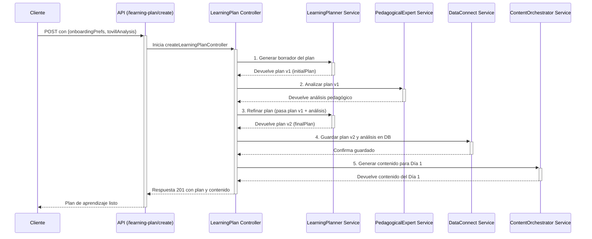

# Tovi Backend 🦊

Bienvenido al backend de Tovi, la plataforma de microlearning impulsada por IA. Este documento sirve como una guía completa de la arquitectura, los flujos de datos y la filosofía de diseño del sistema.

---

## Índice

1.  [Descripción General](#descripción-general)
2.  [Arquitectura y Flujo de Datos](#arquitectura-y-flujo-de-datos)
    -   [Diagrama del Flujo de Creación de Plan](#diagrama-del-flujo-de-creación-de-plan)
3.  [Estructura del Proyecto](#estructura-del-proyecto)
4.  [Orquestación de Agentes LLM](#orquestación-de-agentes-llm)
    -   [Tovill Analyzer](#1-tovill-analyzerservicets)
    -   [Learning Planner](#2-learningplannerservicets)
    -   [Pedagogical Expert](#3-pedagogicalexpertservicets)
    -   [Content Generator](#4-contentgeneratorservicets)
    -   [Analytics & Tovi](#5-otros-agentes-de-soporte)
5.  [Persistencia y Base de Datos (Data Connect)](#persistencia-y-base-de-datos-dataconnectservicets)
6.  [Robustez frente a la IA (Schemas con Zod)](#robustez-frente-a-la-ia-schemas-con-zod)
7.  [Configuración y Entorno](#configuración-y-entorno)
8.  [Cómo Empezar](#cómo-empezar)
9.  [Entorno de Desarrollo Local con Emuladores](#entorno-de-desarrollo-local-con-emuladores)
10. [Simulación y Pruebas](#simulación-y-pruebas)

---

## Descripción General

Este backend, construido con **Node.js, Express y TypeScript**, es el cerebro detrás de Tovi. Se encarga de:
-   Gestionar la autenticación y los perfiles de usuario.
-   Orquestar una serie de **agentes de IA (LLM)** para crear experiencias de aprendizaje personalizadas y dinámicas.
-   Interactuar de forma segura con la base de datos a través de **Firebase Data Connect**.
-   Proveer una API RESTful para que las aplicaciones cliente (iOS, Android, Web) puedan consumir los servicios.

## Arquitectura y Flujo de Datos

El sistema está diseñado siguiendo un patrón de **capas de servicio**, donde cada componente tiene una responsabilidad clara. El flujo de una solicitud típica es:

`API Routes` -> `Middleware (Auth)` -> `Controller` -> `Service(s) / Orchestrator(s)` -> `LLM Agent(s)` -> `DataConnect Service`

-   **Controller**: Orquesta el flujo de la solicitud. No contiene lógica de negocio.
-   **Service**: Contiene la lógica de negocio principal. Para tareas complejas, puede actuar como un orquestador que llama a múltiples servicios más pequeños (como los agentes LLM).
-   **LLM Agents**: Servicios especializados, cada uno con un `prompt` de sistema específico, responsables de una única tarea de IA (analizar, planificar, generar, etc.).
-   **Data Connect Service**: Es la **única capa** que tiene permitido comunicarse con la base de datos, abstrayendo toda la lógica de GraphQL.

### Diagrama del Flujo de Creación de Plan

Este es el flujo más representativo de la arquitectura de orquestación, que implementamos para crear un plan de aprendizaje de alta calidad.



## Estructura del Proyecto

El código fuente se encuentra en el directorio `src/`.

-   `api/`: Define los endpoints de la API REST. Cada archivo (`*.routes.ts`) agrupa rutas relacionadas con una funcionalidad (ej: `onboarding`, `learning-plan`). No contienen lógica, solo enlazan una ruta a un controlador.

-   `controllers/`: Actúan como la capa de orquestación para cada solicitud. Reciben la petición, llaman a los servicios necesarios en el orden correcto y formulan la respuesta HTTP.

-   `middleware/`: Contiene middlewares de Express, como `auth.middleware.ts`, que verifica los tokens de autenticación de Firebase antes de permitir el acceso a rutas protegidas.

-   `services/`: Contiene la lógica de negocio principal.
    -   `llm/`: Subdirectorio crucial que contiene todos los "agentes" de IA.
    -   `dataConnect.service.ts`: La única puerta de enlace a la base de datos (ver sección dedicada).
    -   `contentOrchestrator.service.ts`: Un servicio de alto nivel que orquesta la generación de contenido para un día específico, obteniendo datos del plan, llamando al generador de LLM y guardando el resultado.
    -   `firebaseAdmin.service.ts`: Gestiona la inicialización de Firebase Admin y servicios de Auth/FCM.

-   `config/`: Carga y exporta variables de entorno y otras configuraciones.

-   `utils/`: Funciones de utilidad que se pueden usar en todo el proyecto.

-   `app.ts`: Punto de entrada de la aplicación Express. Configura middlewares globales (CORS, etc.) y registra el router principal de la API.

## Orquestación de Agentes LLM

Ubicados en `src/services/llm/`, cada servicio actúa como un "agente" de IA especializado, con su propio `prompt` de sistema definido en `prompts.ts`.

### 1. `tovillAnalyzer.service.ts`
-   **Objetivo**: Analizar la habilidad que un usuario desea aprender.
-   **Función**: Determina si la habilidad es viable para la plataforma (segura, ética, enseñable online), la categoriza, y la descompone en componentes clave.
-   **Salida**: Un objeto `TovillAnalysis` que sirve como base para la planificación.

### 2. `learningPlanner.service.ts`
-   **Objetivo**: Crear un plan de aprendizaje estructurado y personalizado.
-   **Función**: Se llama en un proceso de dos pasos:
    1.  **Borrador**: Genera un plan inicial basado en el `TovillAnalysis` y las preferencias del usuario.
    2.  **Refinamiento**: Recibe el análisis del `PedagogicalExpert` y lo utiliza para mejorar y finalizar el plan, ajustando la estructura, actividades y recursos.
-   **Salida**: Un objeto `LearningPlan` detallado.

### 3. `pedagogicalExpert.service.ts`
-   **Objetivo**: Revisar un plan de aprendizaje desde una perspectiva educativa.
-   **Función**: Evalúa un `LearningPlan` en base a principios pedagógicos (carga cognitiva, engagement, andragogía). Proporciona un puntaje y recomendaciones concretas para mejorar su efectividad.
-   **Salida**: Un objeto `PedagogicalAnalysis`.

### 4. `contentGenerator.service.ts`
-   **Objetivo**: Crear el contenido de aprendizaje para un día específico.
-   **Función**: Recibe el tema del día, el contexto del usuario y sus `adaptiveInsights` (analíticas de aprendizaje) para generar el material de la lección (`main_content`) y los ejercicios (`exercises`). También tiene una función especializada para crear los desafíos de los "Días de Acción".
-   **Salida**: Un objeto `DayContent` con la lección y sus actividades.

### 5. Otros Agentes de Soporte
-   `analytics.service.ts`: Analiza el historial de un usuario para identificar patrones, predecir el mejor horario para aprender y detectar riesgos de abandono.
-   `toviTheFox.service.ts`: Genera mensajes motivacionales y contextuales de la mascota de la app, Tovi.
-   `notifications.service.ts`: Utiliza los insights de `analytics` para orquestar el envío de notificaciones push personalizadas.
-   `chatOrchestrator.service.ts`: El cerebro del chatbot, capaz de mantener conversaciones contextuales sobre el plan de aprendizaje del usuario.

## Persistencia y Base de Datos (`dataConnect.service.ts`)

Este servicio es el **guardián de la base de datos**. Toda la interacción con Firebase Data Connect debe pasar por aquí.

-   **Abstracción**: Oculta la complejidad de las queries y mutations de GraphQL. El resto de la aplicación no necesita saber GraphQL.
-   **Mapeo de Datos**: Contiene la lógica para mapear los objetos generados por los LLM (definidos en `llm/schemas.ts`) a los tipos de datos que espera la base de datos (definidos en `dataConnect.types.ts`).
-   **Único Punto de Verdad**: Centralizar el acceso a datos facilita la depuración, el refactoring y la implementación de caching en el futuro.

## Robustez frente a la IA (Schemas con Zod)

Una de las mayores debilidades al trabajar con LLMs es su **inconsistencia**. Aunque se les pida una respuesta en formato JSON, pueden cometer errores: usar un nombre de campo incorrecto (`skillName` vs `skill_name`), devolver un número como string (`"2"` en vez de `2`), u omitir campos. Si permitiéramos que estos datos "sucios" entraran en nuestro sistema, provocarían errores impredecibles en tiempo de ejecución.

Para blindar nuestra aplicación contra esto, hemos implementado una **capa de validación y transformación estricta** para cada respuesta del LLM usando la librería **Zod**.

Este "muro de contención" se encuentra en `src/services/llm/schemas.ts`. Cada estructura de datos que esperamos de un LLM sigue un proceso de validación en dos pasos:

1.  **Schema `Raw` (El Aceptador Flexible)**: Primero, definimos un schema que es deliberadamente permisivo. Por ejemplo, `SkillAnalysisSchemaRaw` puede aceptar que `estimated_learning_hours` sea un `string` o un `number`. Esto nos permite capturar la respuesta del LLM sin que falle inmediatamente por pequeños errores de formato.

2.  **Schema Final con `.transform()` (El Limpiador Estricto)**: Luego, aplicamos una función `.transform()` a este schema `Raw`. Esta función es nuestro "centro de limpieza" y tiene varias responsabilidades críticas:
    -   **Limpiar y Normalizar**: Unifica los nombres de los campos a un estándar (ej: `camelCase`).
    -   **Coerción de Tipos**: Convierte los datos al tipo correcto (ej: `string` "15" a `number` 15).
    -   **Validación Compleja**: Aplica reglas de negocio (ej: asegurar que un array no esté vacío).
    -   **Enriquecer**: Añade valores por defecto o campos calculados si es necesario.

El resultado es un **schema final y validado** (ej: `SkillAnalysisSchema`) que se exporta y se utiliza en todo el resto de la aplicación.

**¿Por qué es esto tan importante?**

-   **Previene Errores**: Atajamos los datos malformados en la puerta, antes de que lleguen a nuestra lógica de negocio o a la base de datos. El error de compilación que solucionamos con `AdaptiveLearningRecommendationSchema` es un ejemplo perfecto: el sistema falló en tiempo de compilación, no en producción, porque el contrato de datos no se cumplió.
-   **Código predecible**: El resto de la aplicación puede confiar ciegamente en que los datos que recibe de un LLM son correctos en tipo y estructura, lo que simplifica enormemente el código y reduce los bugs.
-   **Mantenibilidad**: Toda la lógica de "limpieza" de datos de un LLM está centralizada en un solo lugar, haciendo que sea fácil de actualizar y mantener.

Esta arquitectura nos da la flexibilidad de interactuar con la IA sin sacrificar la robustez y fiabilidad de una aplicación tradicional.

## Configuración y Entorno

-   La configuración se gestiona a través de un archivo `.env` en la raíz del proyecto. Ver `.env.example` para las variables requeridas.
-   La variable `NODE_ENV` es crucial:
    -   En `development`, se usan herramientas como `ts-node-dev`.
    -   En `production`, se ejecuta el código transpilado de `dist/`.
    -   En `test`, se desactiva la inicialización de servicios externos como Firebase para permitir la ejecución de mocks, como se ve en los scripts de simulación.

## Cómo Empezar

1.  **Clonar el repositorio.**
2.  **Instalar dependencias:**
    ```bash
    pnpm install
    ```
3.  **Configurar variables de entorno:**
    -   Copia `.env.example` a un nuevo archivo llamado `.env`.
    -   Rellena las variables, especialmente `OPENAI_API_KEY` y las credenciales de Firebase.
4.  **Ejecutar en modo de desarrollo:**
    ```bash
    pnpm dev
    ```
    El servidor se iniciará y se recargará automáticamente con cada cambio.

## Entorno de Desarrollo Local con Emuladores

Para desarrollar y probar la aplicación sin afectar los datos de producción, utilizamos los **Emuladores de Firebase**. Esto nos permite tener una réplica local de servicios como **Data Connect** y **Authentication**, conectados a una base de datos PostgreSQL real que se ejecuta en tu máquina (o en un contenedor Docker).

### Flujo de Trabajo Recomendado

La clave es entender que hay dos procesos distintos: la **migración del esquema** de la base de datos (que se hace solo cuando cambias el schema `*.gql`) y el **ciclo normal de desarrollo** (que haces todos los días).

#### 1. Migración del Esquema (Solo cuando hay cambios en `dataconnect/schema/`)

Este proceso aplica tus cambios del esquema GraphQL a la base de datos local.

1.  **IMPORTANTE**: Asegúrate de que los emuladores de Firebase **NO** estén corriendo. Si tienes una terminal con `firebase emulators:start`, detenla (Ctrl+C).
2.  Ejecuta el script de migración:
    ```bash
    pnpm test:migrate
    ```
3.  **¿Qué hace este comando?** Es un script autosuficiente que utiliza `firebase emulators:exec`. Inicia los emuladores, ejecuta el comando `firebase dataconnect:sql:migrate` en el entorno controlado del emulador para aplicar los cambios y luego se apaga automáticamente. Los cambios quedan guardados en tu base de datos PostgreSQL local.

#### 2. Desarrollo y Pruebas (El ciclo habitual)

Este es el flujo que usarás el 99% del tiempo.

1.  **Terminal 1 - Iniciar los Emuladores**:
    Con la base de datos ya migrada, inicia los emuladores para que provean los servicios de backend (Auth, Data Connect) de forma persistente.
    ```bash
    firebase emulators:start --project=tu-project-id
    ```
    *   Reemplaza `tu-project-id` por el ID de tu proyecto de Firebase.
    *   Verás logs que confirman que los emuladores de Authentication y Data Connect se están ejecutando. El SDK de Firebase en tu código se conectará automáticamente a ellos.

2.  **Terminal 2 - Iniciar el Servidor**:
    Con los emuladores corriendo, inicia tu servidor de Express en modo de desarrollo.
    ```bash
    pnpm dev
    ```

3.  **Terminal 3 - Ejecutar Pruebas**:
    Puedes ejecutar las pruebas de integración en cualquier momento mientras los emuladores y el servidor estén activos.
    ```bash
    pnpm test
    ```

## Configuración y Troubleshooting de Firebase Data Connect

Configurar Data Connect puede ser complejo debido a la interacción entre la CLI de Firebase, la CLI de `gcloud` y los permisos de IAM en Google Cloud. Esta sección documenta los problemas comunes y sus soluciones.

### Contexto: ¿Qué intenta hacer la CLI?

Cuando ejecutas comandos como `firebase dataconnect:sql:migrate` o `deploy`, la CLI de Firebase no solo trabaja localmente. También se comunica con las APIs de Google Cloud (`dataconnect.googleapis.com`, `sqladmin.googleapis.com`) para:
1.  Verificar que el servicio Data Connect existe en tu proyecto de GCP.
2.  Validar que el "conector" (el enlace a tu instancia de Cloud SQL) está bien configurado.
3.  Asegurarse de que tienes los permisos de IAM para realizar estas operaciones.

Muchos errores surgen cuando esta comunicación con la nube falla, incluso si solo quieres trabajar con los emuladores.

### Troubleshooting de Errores Comunes de Migración

#### Error: `403 Forbidden` o `PERMISSION_DENIED`

Este es un error de permisos. La cuenta con la que estás autenticado en `gcloud` (`gcloud auth list`) no tiene los roles necesarios en el proyecto de GCP.

1.  **Verifica la Autenticación**:
    ```bash
    gcloud auth list
    firebase login:list
    ```
    Asegúrate de que la cuenta activa en ambas CLIs es la correcta y tiene acceso al proyecto de GCP. Si no, re-autentica con `gcloud auth login` and `firebase login`.

2.  **Verifica el Proyecto**:
    ```bash
    gcloud config get-value project
    firebase projects:list
    ```
    Asegúrate de que el proyecto configurado es el correcto. Si no, cámbialo con `gcloud config set project TU_PROJECT_ID`.

3.  **Verifica los Roles de IAM**:
    -   Ve a la sección de **IAM** en la consola de Google Cloud.
    -   Busca tu cuenta principal (la que usas en la CLI).
    -   Asegúrate de que tienes, como mínimo, los siguientes roles:
        -   `Owner` (Propietario) - La opción más simple para desarrollo.
        -   O una combinación de `Editor` (Editor) y `Cloud SQL Admin` (Administrador de Cloud SQL). El rol de **Cloud SQL Admin** es crucial.

#### Error: `401 CREDENTIALS_MISSING` o `Authentication failed`

Este error es más engañoso. Indica que la CLI de Firebase **ni siquiera está intentando enviar tus credenciales**. En lugar de un rechazo por falta de permisos (403), la API de Google responde que la petición llegó sin ninguna autenticación (401).

Esto suele ser un problema interno o un bug en la propia CLI de Firebase, donde no adjunta correctamente el token de autenticación de `gcloud` a sus solicitudes de API.

**Solución Principal: Usar `emulators:exec`**
Como se describe en el flujo de trabajo, el comando `pnpm test:migrate` es la solución más robusta. Al ejecutar la migración *dentro* del entorno del emulador, se abstrae de muchos de estos problemas de autenticación con la nube.

### Plan de Escape: Creación Manual del Servicio en la Consola de GCP

Si la CLI se vuelve intratable y te impide desplegar o trabajar, puedes configurar los recursos de Data Connect manualmente en la consola de Google Cloud. Esto le dará a la CLI lo que necesita encontrar en la nube para poder continuar.

1.  **Ve al Panel de Data Connect**:
    -   En la consola de Google Cloud, busca "Data Connect" en la barra de búsqueda o navega directamente.
    -   Asegúrate de estar en el proyecto correcto.

2.  **Crea el "Servicio"**:
    -   Si no existe ningún servicio, verás un botón para crear uno.
    -   Dale un nombre. Este nombre **debe coincidir** con el campo `serviceId` de tu archivo `dataconnect/dataconnect.yaml`. Por defecto, suele ser el nombre del proyecto o `default`.

3.  **Crea el "Conector"**:
    -   Dentro de tu servicio, ve a la pestaña "Conectores" (`Connectors`).
    -   Crea un nuevo conector.
    -   **Tipo de Base de Datos**: Selecciona `PostgreSQL`.
    -   **Nombre del Conector**: Dale un nombre. Este nombre **debe coincidir** con el campo `connectorId` en `dataconnect/dataconnect.yaml`. Por defecto es `cloudsql-postgresql`.
    -   **Instancia de Cloud SQL**: Selecciona la instancia de Cloud SQL de producción a la que este conector se vinculará.
    -   **Base de Datos**: Escribe el nombre de la base de datos dentro de la instancia (ej: `postgres`).
    -   **Autenticación**: Habilita la "Autenticación de IAM para la base de datos".

Una vez que el servicio y el conector existen en la nube y sus nombres coinciden con tu `dataconnect.yaml`, la CLI de Firebase (`firebase deploy`) tendrá muchas más probabilidades de funcionar, ya que no intentará crearlos programáticamente (que es donde parece fallar) sino que simplemente los actualizará.

## Simulación y Pruebas

Para facilitar el desarrollo y las pruebas sin depender de una base de datos real o de la UI, hemos creado scripts de simulación en `tests/cli/`.

-   **`pnpm simulate`**:
    -   Ejecuta una simulación interactiva completa del flujo de onboarding.
    -   Usa un mock de la base de datos en memoria.
    -   Al finalizar, guarda los artefactos generados (plan y usuario) en `tests/fixtures/`.

-   **`pnpm test:next-day`**:
    -   Ejecuta una prueba no interactiva que carga los datos de `tests/fixtures/`.
    -   Testea específicamente la lógica para generar el contenido del día siguiente (Día 2).
    -   Esto permite probar partes aisladas del sistema de forma rápida y repetible.

## Pruebas de Integración de API

El proyecto cuenta con un conjunto de pruebas de integración (`tests/api/*.spec.ts`) que utilizan **Jest** para ejecutar peticiones HTTP reales contra el servidor.

A diferencia de las simulaciones, estas pruebas **requieren que el entorno de desarrollo completo (emuladores y servidor) esté en ejecución**, como se describe en la sección "Flujo 2: Desarrollo y Pruebas".

### Cómo Ejecutar las Pruebas

Con el servidor (`pnpm dev`) y los emuladores (`firebase emulators:start`) corriendo en sus respectivas terminales, simplemente ejecuta:

```bash
pnpm test
```

Jest descubrirá y ejecutará todos los archivos de prueba. El flag `--runInBand` (configurado en `package.json`) asegura que los archivos de prueba se ejecuten de forma secuencial, lo cual es importante para evitar conflictos al crear y eliminar datos de prueba en un entorno compartido.
