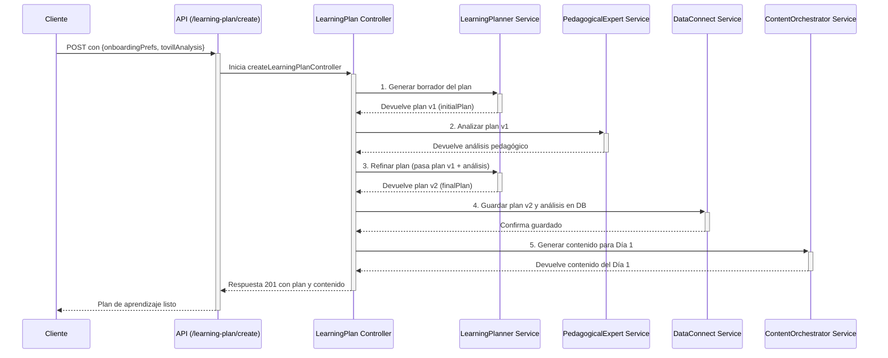

# Tovi Backend 🦊

Bienvenido al backend de Tovi, la plataforma de microlearning impulsada por IA. Este documento sirve como una guía completa de la arquitectura, los flujos de datos y la filosofía de diseño del sistema.

---

## Índice

1.  [Descripción General](#descripción-general)
2.  [Arquitectura y Flujo de Datos](#arquitectura-y-flujo-de-datos)
    -   [Diagrama del Flujo de Creación de Plan](#diagrama-del-flujo-de-creación-de-plan)
3.  [Estructura del Proyecto](#estructura-del-proyecto)
4.  [Orquestación de Agentes LLM](#orquestación-de-agentes-llm)
    -   [Tovill Analyzer](#1-tovill-analyzerservicets)
    -   [Learning Planner](#2-learningplannerservicets)
    -   [Pedagogical Expert](#3-pedagogicalexpertservicets)
    -   [Content Generator](#4-contentgeneratorservicets)
    -   [Analytics & Tovi/Tovi](#5-otros-agentes-de-soporte)
5.  [Persistencia y Base de Datos (Data Connect)](#persistencia-y-base-de-datos-dataconnectservicets)
6.  [Robustez frente a la IA (Schemas con Zod)](#robustez-frente-a-la-ia-schemas-con-zod)
7.  [Configuración y Entorno](#configuración-y-entorno)
8.  [Cómo Empezar](#cómo-empezar)
9.  [Simulación y Pruebas](#simulación-y-pruebas)

---

## Descripción General

Este backend, construido con **Node.js, Express y TypeScript**, es el cerebro detrás de Tovi. Se encarga de:
-   Gestionar la autenticación y los perfiles de usuario.
-   Orquestar una serie de **agentes de IA (LLM)** para crear experiencias de aprendizaje personalizadas y dinámicas.
-   Interactuar de forma segura con la base de datos a través de **Firebase Data Connect**.
-   Proveer una API RESTful para que las aplicaciones cliente (iOS, Android, Web) puedan consumir los servicios.

## Arquitectura y Flujo de Datos

El sistema está diseñado siguiendo un patrón de **capas de servicio**, donde cada componente tiene una responsabilidad clara. El flujo de una solicitud típica es:

`API Routes` -> `Middleware (Auth)` -> `Controller` -> `Service(s) / Orchestrator(s)` -> `LLM Agent(s)` -> `DataConnect Service`

-   **Controller**: Orquesta el flujo de la solicitud. No contiene lógica de negocio.
-   **Service**: Contiene la lógica de negocio principal. Para tareas complejas, puede actuar como un orquestador que llama a múltiples servicios más pequeños (como los agentes LLM).
-   **LLM Agents**: Servicios especializados, cada uno con un `prompt` de sistema específico, responsables de una única tarea de IA (analizar, planificar, generar, etc.).
-   **Data Connect Service**: Es la **única capa** que tiene permitido comunicarse con la base de datos, abstrayendo toda la lógica de GraphQL.

### Diagrama del Flujo de Creación de Plan

Este es el flujo más representativo de la arquitectura de orquestación, que implementamos para crear un plan de aprendizaje de alta calidad.



## Estructura del Proyecto

El código fuente se encuentra en el directorio `src/`.

-   `api/`: Define los endpoints de la API REST. Cada archivo (`*.routes.ts`) agrupa rutas relacionadas con una funcionalidad (ej: `onboarding`, `learning-plan`). No contienen lógica, solo enlazan una ruta a un controlador.

-   `controllers/`: Actúan como la capa de orquestación para cada solicitud. Reciben la petición, llaman a los servicios necesarios en el orden correcto y formulan la respuesta HTTP.

-   `middleware/`: Contiene middlewares de Express, como `auth.middleware.ts`, que verifica los tokens de autenticación de Firebase antes de permitir el acceso a rutas protegidas.

-   `services/`: Contiene la lógica de negocio principal.
    -   `llm/`: Subdirectorio crucial que contiene todos los "agentes" de IA.
    -   `dataConnect.service.ts`: La única puerta de enlace a la base de datos (ver sección dedicada).
    -   `contentOrchestrator.service.ts`: Un servicio de alto nivel que orquesta la generación de contenido para un día específico, obteniendo datos del plan, llamando al generador de LLM y guardando el resultado.
    -   `firebaseAdmin.service.ts`: Gestiona la inicialización de Firebase Admin y servicios de Auth/FCM.

-   `config/`: Carga y exporta variables de entorno y otras configuraciones.

-   `utils/`: Funciones de utilidad que se pueden usar en todo el proyecto.

-   `app.ts`: Punto de entrada de la aplicación Express. Configura middlewares globales (CORS, etc.) y registra el router principal de la API.

## Orquestación de Agentes LLM

Ubicados en `src/services/llm/`, cada servicio actúa como un "agente" de IA especializado, con su propio `prompt` de sistema definido en `prompts.ts`.

### 1. `tovillAnalyzer.service.ts`
-   **Objetivo**: Analizar la habilidad que un usuario desea aprender.
-   **Función**: Determina si la habilidad es viable para la plataforma (segura, ética, enseñable online), la categoriza, y la descompone en componentes clave.
-   **Salida**: Un objeto `TovillAnalysis` que sirve como base para la planificación.

### 2. `learningPlanner.service.ts`
-   **Objetivo**: Crear un plan de aprendizaje estructurado y personalizado.
-   **Función**: Se llama en un proceso de dos pasos:
    1.  **Borrador**: Genera un plan inicial basado en el `TovillAnalysis` y las preferencias del usuario.
    2.  **Refinamiento**: Recibe el análisis del `PedagogicalExpert` y lo utiliza para mejorar y finalizar el plan, ajustando la estructura, actividades y recursos.
-   **Salida**: Un objeto `LearningPlan` detallado.

### 3. `pedagogicalExpert.service.ts`
-   **Objetivo**: Revisar un plan de aprendizaje desde una perspectiva educativa.
-   **Función**: Evalúa un `LearningPlan` en base a principios pedagógicos (carga cognitiva, engagement, andragogía). Proporciona un puntaje y recomendaciones concretas para mejorar su efectividad.
-   **Salida**: Un objeto `PedagogicalAnalysis`.

### 4. `contentGenerator.service.ts`
-   **Objetivo**: Crear el contenido de aprendizaje para un día específico.
-   **Función**: Recibe el tema del día, el contexto del usuario y sus `adaptiveInsights` (analíticas de aprendizaje) para generar el material de la lección (`main_content`) y los ejercicios (`exercises`). También tiene una función especializada para crear los desafíos de los "Días de Acción".
-   **Salida**: Un objeto `DayContent` con la lección y sus actividades.

### 5. Otros Agentes de Soporte
-   `analytics.service.ts`: Analiza el historial de un usuario para identificar patrones, predecir el mejor horario para aprender y detectar riesgos de abandono.
-   `toviTheFox.service.ts`: Genera mensajes motivacionales y contextuales de la mascota de la app, Tovi.
-   `notifications.service.ts`: Utiliza los insights de `analytics` para orquestar el envío de notificaciones push personalizadas.
-   `chatOrchestrator.service.ts`: El cerebro del chatbot, capaz de mantener conversaciones contextuales sobre el plan de aprendizaje del usuario.

## Persistencia y Base de Datos (`dataConnect.service.ts`)

Este servicio es el **guardián de la base de datos**. Toda la interacción con Firebase Data Connect debe pasar por aquí.

-   **Abstracción**: Oculta la complejidad de las queries y mutations de GraphQL. El resto de la aplicación no necesita saber GraphQL.
-   **Mapeo de Datos**: Contiene la lógica para mapear los objetos generados por los LLM (definidos en `llm/schemas.ts`) a los tipos de datos que espera la base de datos (definidos en `dataConnect.types.ts`).
-   **Único Punto de Verdad**: Centralizar el acceso a datos facilita la depuración, el refactoring y la implementación de caching en el futuro.

## Robustez frente a la IA (Schemas con Zod)

Trabajar con LLMs implica que las respuestas, aunque estructuradas, pueden tener inconsistencias. Para manejar esto, usamos una estrategia de validación en dos pasos en `src/services/llm/schemas.ts`:

1.  **Schema `Raw`**: Se define un schema interno (ej: `DayContentSchemaRaw`) que es **permisivo**. Acepta múltiples alias para un mismo campo (ej: `correct_answer` y `correctAnswer`), tipos de datos flexibles (ej: `string | number`) y campos opcionales.
2.  **`.transform()`**: Se aplica una función de transformación a este schema `Raw`. Esta función se encarga de:
    -   **Limpiar**: Normaliza los nombres de los campos a un único estándar (ej: `camelCase`).
    -   **Convertir**: Estandariza los tipos de datos (ej: convierte una respuesta en texto al índice numérico correcto).
    -   **Validar**: Realiza validaciones más complejas (ej: que el índice de una respuesta esté dentro del rango de opciones).
    -   **Enriquecer**: Añade valores por defecto o campos calculados.

El schema final que se exporta y se usa en el resto de la aplicación es el resultado de esta transformación, garantizando que solo datos **limpios, validados y estandarizados** circulen por nuestro sistema.

## Configuración y Entorno

-   La configuración se gestiona a través de un archivo `.env` en la raíz del proyecto. Ver `.env.example` para las variables requeridas.
-   La variable `NODE_ENV` es crucial:
    -   En `development`, se usan herramientas como `ts-node-dev`.
    -   En `production`, se ejecuta el código transpilado de `dist/`.
    -   En `test`, se desactiva la inicialización de servicios externos como Firebase para permitir la ejecución de mocks, como se ve en los scripts de simulación.

## Cómo Empezar

1.  **Clonar el repositorio.**
2.  **Instalar dependencias:**
    ```bash
    pnpm install
    ```
3.  **Configurar variables de entorno:**
    -   Copia `.env.example` a un nuevo archivo llamado `.env`.
    -   Rellena las variables, especialmente `OPENAI_API_KEY` y las credenciales de Firebase.
4.  **Ejecutar en modo de desarrollo:**
    ```bash
    pnpm dev
    ```
    El servidor se iniciará y se recargará automáticamente con cada cambio.

## Simulación y Pruebas

Para facilitar el desarrollo y las pruebas sin depender de una base de datos real o de la UI, hemos creado scripts de simulación en `tests/cli/`.

-   **`pnpm simulate`**:
    -   Ejecuta una simulación interactiva completa del flujo de onboarding.
    -   Usa un mock de la base de datos en memoria.
    -   Al finalizar, guarda los artefactos generados (plan y usuario) en `tests/fixtures/`.

-   **`pnpm test:next-day`**:
    -   Ejecuta una prueba no interactiva que carga los datos de `tests/fixtures/`.
    -   Testea específicamente la lógica para generar el contenido del día siguiente (Día 2).
    -   Esto permite probar partes aisladas del sistema de forma rápida y repetible.
