# Tovi Backend 🦊

Bienvenido al backend de Tovi, la plataforma de microlearning impulsada por IA. Este documento sirve como una guía completa de la arquitectura, los flujos de datos y la filosofía de diseño del sistema.

---

## Índice

1.  [Descripción General](#descripción-general)
2.  [🚀 Desarrollo Local - Guía Rápida](#desarrollo-local---guía-rápida)
3.  [☁️ Despliegue a Google Cloud Run](#despliegue-a-google-cloud-run)
4.  [Arquitectura y Flujo de Datos](#arquitectura-y-flujo-de-datos)
    -   [Diagrama del Flujo de Creación de Plan](#diagrama-del-flujo-de-creación-de-plan)
5.  [Estructura del Proyecto](#estructura-del-proyecto)
6.  [Orquestación de Agentes LLM](#orquestación-de-agentes-llm)
    -   [Tovill Analyzer](#1-tovill-analyzerservicets)
    -   [Learning Planner](#2-learningplannerservicets)
    -   [Pedagogical Expert](#3-pedagogicalexpertservicets)
    -   [Content Generator](#4-contentgeneratorservicets)
    -   [Analytics & Tovi](#5-otros-agentes-de-soporte)
7.  [Persistencia y Base de Datos (Data Connect)](#persistencia-y-base-de-datos-dataconnectservicets)
8.  [Robustez frente a la IA (Schemas con Zod)](#robustez-frente-a-la-ia-schemas-con-zod)
9.  [Configuración y Entorno](#configuración-y-entorno)
10. [Cómo Empezar](#cómo-empezar)
11. [Entorno de Desarrollo Local con Emuladores](#entorno-de-desarrollo-local-con-emuladores)
12. [Simulación y Pruebas](#simulación-y-pruebas)
13. [Pruebas End-to-End (E2E) con Emuladores](#pruebas-end-to-end-e2e-con-emuladores)
14. [Scripts del Proyecto](#scripts-del-proyecto)

---

## Descripción General

Este backend, construido con **Node.js, Express y TypeScript**, es el cerebro detrás de Tovi. Se encarga de:
-   Gestionar la autenticación y los perfiles de usuario.
-   Orquestar una serie de **agentes de IA (LLM)** para crear experiencias de aprendizaje personalizadas y dinámicas.
-   Interactuar de forma segura con la base de datos a través de **Firebase Data Connect**.
-   Proveer una API RESTful para que las aplicaciones cliente (iOS, Android, Web) puedan consumir los servicios.

---

## 🚀 Desarrollo Local - Guía Rápida

Para desarrollar localmente, necesitarás **4 terminales** ejecutándose en paralelo. Sigue este orden exacto:

### **📋 Prerequisitos**
```bash
# 1. Instalar dependencias del backend
cd skillix-backend
pnpm install

# 2. Configurar variables de entorno
cp .env.example .env
# Edita .env con tus valores reales (ver sección Configuración)

# 3. Instalar Firebase CLI globalmente (si no lo tienes)
npm install -g firebase-tools

# 4. Autenticarte con Firebase
firebase login
```

### **🔥 Terminal 1: Emuladores de Firebase**
```bash
cd skillix-backend
firebase emulators:start --project=skillix-db
```
**¿Qué hace?** Inicia los emuladores de Firebase (Auth y Data Connect) en localhost.  
**Estado esperado:** Verás logs confirmando que los emuladores están corriendo.

### **🖥️ Terminal 2: Backend Express**
```bash
cd skillix-backend
pnpm dev
```
**¿Qué hace?** Inicia tu servidor Express en modo desarrollo en puerto 8080.  
**Estado esperado:** `🦊 Tovi Backend listening on port 8080`

### **📱 Terminal 3: Metro Bundler (React Native)**
```bash
cd skillix
pnpm start
```
**¿Qué hace?** Inicia Metro, el bundler de JavaScript para React Native.  
**Estado esperado:** Metro corriendo en puerto 8081.

### **🎯 Terminal 4: App React Native**
```bash
cd skillix
# Para iOS:
pnpm ios

# Para Android:
pnpm android
```
**¿Qué hace?** Compila y ejecuta la app en el simulador/emulador.  
**Estado esperado:** App funcionando y conectándose al backend local.

### **🔗 URLs Importantes**
- **Backend API:** http://localhost:8080
- **Firebase Auth Emulator:** http://localhost:9099
- **Firebase Data Connect Emulator:** http://localhost:9399
- **Metro Bundler:** http://localhost:8081

### **✅ Verificación Rápida**
```bash
# Probar que el backend responde
curl http://localhost:8080/api/health

# Debería retornar: "OK"
```

### **🛠️ Troubleshooting Común**
- **Error "Puerto en uso":** Mata procesos con `kill -9 $(lsof -ti:8080)`
- **Firebase no conecta:** Verifica que `FIREBASE_AUTH_EMULATOR_HOST=localhost:9099` en tu .env
- **Metro falla:** Limpia cache con `pnpm start --reset-cache`

---

## ☁️ Despliegue a Google Cloud Run

Esta sección explica cómo desplegar el backend a Google Cloud Run tanto para **primera vez** como para **actualizaciones**.

### **📋 Prerequisitos para Producción**

```bash
# 1. Instalar Google Cloud CLI
# macOS:
brew install google-cloud-sdk

# Windows/Linux: https://cloud.google.com/sdk/docs/install

# 2. Autenticarte con Google Cloud
gcloud auth login
gcloud auth application-default login

# 3. Configurar proyecto
gcloud config set project tu-project-id

# 4. Habilitar APIs necesarias
gcloud services enable cloudbuild.googleapis.com
gcloud services enable run.googleapis.com
gcloud services enable sqladmin.googleapis.com
```

### **🔧 Configuración Inicial (Primera Vez)**

#### **1. Configurar Variables de Entorno de Producción**

Crea las variables de entorno en Google Cloud Run:

```bash
# Variables principales (reemplaza con tus valores reales)
gcloud run services update skillix-backend \
  --region=us-central1 \
  --set-env-vars="NODE_ENV=production" \
  --set-env-vars="PORT=8080" \
  --set-env-vars="FIREBASE_PROJECT_ID=skillix-db" \
  --set-env-vars="OPENAI_API_KEY=tu-openai-api-key" \
  --set-env-vars="OPENAI_MODEL=gpt-4o-mini"

# Variables de Firebase (para producción)
gcloud run services update skillix-backend \
  --region=us-central1 \
  --set-env-vars="DATA_CONNECT_SERVICE_ID=skillix-db-service" \
  --set-env-vars="DATA_CONNECT_LOCATION=us-central1"
```

#### **2. Configurar Service Account Key**

```bash
# 1. Crear un Service Account
gcloud iam service-accounts create skillix-backend-sa \
  --display-name="Skillix Backend Service Account"

# 2. Asignar roles necesarios
gcloud projects add-iam-policy-binding tu-project-id \
  --member="serviceAccount:skillix-backend-sa@tu-project-id.iam.gserviceaccount.com" \
  --role="roles/dataconnect.serviceAgent"

gcloud projects add-iam-policy-binding tu-project-id \
  --member="serviceAccount:skillix-backend-sa@tu-project-id.iam.gserviceaccount.com" \
  --role="roles/firebase.admin"

# 3. Crear key JSON
gcloud iam service-accounts keys create ./serviceAccountKey.json \
  --iam-account=skillix-backend-sa@tu-project-id.iam.gserviceaccount.com

# 4. Subir key como secret (más seguro que variable de entorno)
gcloud secrets create firebase-service-account-key \
  --data-file=./serviceAccountKey.json
```

### **🚀 Métodos de Despliegue**

#### **Método 1: Despliegue Manual (Rápido)**

```bash
# 1. Construir y desplegar directamente
gcloud run deploy skillix-backend \
  --source . \
  --region=us-central1 \
  --platform=managed \
  --allow-unauthenticated \
  --port=8080 \
  --memory=1Gi \
  --cpu=1 \
  --max-instances=10 \
  --set-env-vars="NODE_ENV=production,PORT=8080"
```

#### **Método 2: Con Docker (Más Control)**

```bash
# 1. Construir la imagen Docker localmente
docker build -t gcr.io/tu-project-id/skillix-backend:latest .

# 2. Subir imagen a Container Registry
docker push gcr.io/tu-project-id/skillix-backend:latest

# 3. Desplegar desde la imagen
gcloud run deploy skillix-backend \
  --image gcr.io/tu-project-id/skillix-backend:latest \
  --region=us-central1 \
  --platform=managed \
  --allow-unauthenticated
```

#### **Método 3: Con Cloud Build (Recomendado para Producción)**

```bash
# 1. Verificar que cloudbuild.yaml está configurado correctamente
cat cloudbuild.yaml

# 2. Ejecutar build y deploy automático
gcloud builds submit --config cloudbuild.yaml .

# 3. (Opcional) Configurar trigger automático para commits
gcloud builds triggers create github \
  --repo-name=skillix-backend \
  --repo-owner=tu-github-username \
  --branch-pattern="main" \
  --build-config=cloudbuild.yaml
```

### **🔄 Actualizaciones (Pushes Posteriores)**

#### **Para cambios de código:**

```bash
# Opción A: Despliegue rápido
gcloud run deploy skillix-backend \
  --source . \
  --region=us-central1

# Opción B: Con Cloud Build (si está configurado)
gcloud builds submit --config cloudbuild.yaml .

# Opción C: Si tienes trigger automático configurado
git push origin main  # Se despliega automáticamente
```

#### **Para cambios de variables de entorno:**

```bash
# Actualizar variables específicas
gcloud run services update skillix-backend \
  --region=us-central1 \
  --set-env-vars="NUEVA_VARIABLE=nuevo-valor"

# Ver variables actuales
gcloud run services describe skillix-backend \
  --region=us-central1 \
  --format="export"
```

### **🔒 Configuración de Seguridad**

#### **Service Account para Cloud Run:**

```bash
# Configurar el servicio para usar el service account creado
gcloud run services update skillix-backend \
  --region=us-central1 \
  --service-account=skillix-backend-sa@tu-project-id.iam.gserviceaccount.com
```

#### **Secrets Manager (Recomendado):**

```bash
# En lugar de variables de entorno, usar secrets para datos sensibles
gcloud run services update skillix-backend \
  --region=us-central1 \
  --set-secrets="OPENAI_API_KEY=openai-key:latest" \
  --set-secrets="FIREBASE_KEY=firebase-service-account-key:latest"
```

### **📊 Verificación del Despliegue**

```bash
# 1. Obtener URL del servicio
SERVICE_URL=$(gcloud run services describe skillix-backend \
  --region=us-central1 \
  --format="value(status.url)")

echo "Service URL: $SERVICE_URL"

# 2. Probar health check
curl "$SERVICE_URL/api/health"

# 3. Ver logs en tiempo real
gcloud run services logs tail skillix-backend --region=us-central1

# 4. Ver métricas
gcloud run services describe skillix-backend \
  --region=us-central1 \
  --format="table(status.conditions[].type,status.conditions[].status)"
```

### **🛠️ Troubleshooting en Producción**

#### **Problemas comunes y soluciones:**

```bash
# 1. Ver logs detallados
gcloud run services logs read skillix-backend \
  --region=us-central1 \
  --limit=50

# 2. Verificar configuración del servicio
gcloud run services describe skillix-backend \
  --region=us-central1

# 3. Probar conectividad a Firebase
gcloud run services proxy skillix-backend \
  --region=us-central1 \
  --port=8080

# 4. Reiniciar servicio (forzar nuevo deployment)
gcloud run services replace service.yaml --region=us-central1
```

#### **Monitoreo:**

```bash
# Configurar alertas
gcloud alpha monitoring policies create \
  --policy-from-file=monitoring-policy.yaml

# Ver métricas de uso
gcloud run services describe skillix-backend \
  --region=us-central1 \
  --format="table(metadata.name,status.latestReadyRevisionName,status.url)"
```

### **🔗 URLs Finales**

Una vez desplegado, tendrás:

- **API Production:** `https://skillix-backend-xxxxxxx-uc.a.run.app`
- **Health Check:** `https://skillix-backend-xxxxxxx-uc.a.run.app/api/health`
- **Cloud Console:** `https://console.cloud.google.com/run/detail/us-central1/skillix-backend`

### **📝 Checklist de Despliegue**

- [ ] Variables de entorno configuradas
- [ ] Service Account creado y configurado
- [ ] Firebase Data Connect configurado para producción
- [ ] OpenAI API Key configurada
- [ ] Health check funcionando
- [ ] Logs sin errores críticos
- [ ] Frontend actualizado con URL de producción

---

## Arquitectura y Flujo de Datos

El sistema está diseñado siguiendo un patrón de **capas de servicio**, donde cada componente tiene una responsabilidad clara. El flujo de una solicitud típica es:

`API Routes` -> `Middleware (Auth)` -> `Controller` -> `Service(s) / Orchestrator(s)` -> `LLM Agent(s)` -> `DataConnect Service`

-   **Controller**: Orquesta el flujo de la solicitud. No contiene lógica de negocio.
-   **Service**: Contiene la lógica de negocio principal. Para tareas complejas, puede actuar como un orquestador que llama a múltiples servicios más pequeños (como los agentes LLM).
-   **LLM Agents**: Servicios especializados, cada uno con un `prompt` de sistema específico, responsables de una única tarea de IA (analizar, planificar, generar, etc.).
-   **Data Connect Service**: Es la **única capa** que tiene permitido comunicarse con la base de datos, abstrayendo toda la lógica de GraphQL.

### Diagrama del Flujo de Creación de Plan

Este es el flujo más representativo de la arquitectura de orquestación, que implementamos para crear un plan de aprendizaje de alta calidad.

```mermaid
sequenceDiagram
    participant C as Cliente
    participant API as API (/learning-plan/create)
    participant LC as LearningPlan Controller
    participant LP as LearningPlanner Service
    participant PE as PedagogicalExpert Service
    participant DC as DataConnect Service
    participant CO as ContentOrchestrator Service

    C->>+API: POST con {onboardingPrefs, tovillAnalysis}
    API->>+LC: Inicia createLearningPlanController
    LC->>+LP: 1. Generar borrador del plan
    LP-->>-LC: Devuelve plan v1 (initialPlan)
    LC->>+PE: 2. Analizar plan v1
    PE-->>-LC: Devuelve análisis pedagógico
    LC->>+LP: 3. Refinar plan (pasa plan v1 + análisis)
    LP-->>-LC: Devuelve plan v2 (finalPlan)
    LC->>+DC: 4. Guardar plan v2 y análisis en DB
    DC-->>-LC: Confirma guardado
    LC->>+CO: 5. Generar contenido para Día 1
    CO-->>-LC: Devuelve contenido del Día 1
    LC-->>-API: Respuesta 201 con plan y contenido
    API-->>-C: Plan de aprendizaje listo
```



## Estructura del Proyecto

El código fuente se encuentra en el directorio `src/`.

-   `api/`: Define los endpoints de la API REST. Cada archivo (`*.routes.ts`) agrupa rutas relacionadas con una funcionalidad (ej: `onboarding`, `learning-plan`). No contienen lógica, solo enlazan una ruta a un controlador.

-   `controllers/`: Actúan como la capa de orquestación para cada solicitud. Reciben la petición, llaman a los servicios necesarios en el orden correcto y formulan la respuesta HTTP.

-   `middleware/`: Contiene middlewares de Express, como `auth.middleware.ts`, que verifica los tokens de autenticación de Firebase antes de permitir el acceso a rutas protegidas.

-   `services/`: Contiene la lógica de negocio principal.
    -   `firebase.service.ts`: Gestiona la inicialización de Firebase Admin y provee servicios unificados para Auth, DataConnect y FCM.
    -   `dataConnect.service.ts`: Provee una capa de abstracción para interactuar con la base de datos de Firebase Data Connect, manejando las operaciones GraphQL.
    -   `dataConnect.operations.ts`: Contiene todas las queries y mutations de GraphQL como constantes.
    -   `dataConnect.types.ts`: Define los tipos de datos y enums que se corresponden con el schema de Data Connect.
    -   `llm/`: Contiene todos los servicios relacionados con el LLM.
        -   `contentGenerator.service.ts`: Orquesta la generación de contenido (planes de estudio, contenido diario).
    -   `contentOrchestrator.service.ts`: Un servicio de alto nivel que orquesta la generación de contenido para un día específico.

-   `config/`: Carga y exporta variables de entorno y otras configuraciones.

-   `utils/`: Funciones de utilidad que se pueden usar en todo el proyecto.

-   `app.ts`: Punto de entrada de la aplicación Express. Configura middlewares globales (CORS, etc.) y registra el router principal de la API.

## Orquestación de Agentes LLM

Ubicados en `src/services/llm/`, cada servicio actúa como un "agente" de IA especializado, con su propio `prompt` de sistema definido en `prompts.ts`.

### 1. `tovillAnalyzer.service.ts`
-   **Objetivo**: Analizar la habilidad que un usuario desea aprender.
-   **Función**: Determina si la habilidad es viable para la plataforma (segura, ética, enseñable online), la categoriza, y la descompone en componentes clave.
-   **Salida**: Un objeto `TovillAnalysis` que sirve como base para la planificación.

### 2. `learningPlanner.service.ts`
-   **Objetivo**: Crear un plan de aprendizaje estructurado y personalizado.
-   **Función**: Se llama en un proceso de dos pasos:
    1.  **Borrador**: Genera un plan inicial basado en el `TovillAnalysis` y las preferencias del usuario.
    2.  **Refinamiento**: Recibe el análisis del `PedagogicalExpert` y lo utiliza para mejorar y finalizar el plan, ajustando la estructura, actividades y recursos.
-   **Salida**: Un objeto `LearningPlan` detallado.

### 3. `pedagogicalExpert.service.ts`
-   **Objetivo**: Revisar un plan de aprendizaje desde una perspectiva educativa.
-   **Función**: Evalúa un `LearningPlan` en base a principios pedagógicos (carga cognitiva, engagement, andragogía). Proporciona un puntaje y recomendaciones concretas para mejorar su efectividad.
-   **Salida**: Un objeto `PedagogicalAnalysis`.

### 4. `contentGenerator.service.ts`
-   **Objetivo**: Crear el contenido de aprendizaje para un día específico.
-   **Función**: Recibe el tema del día, el contexto del usuario y sus `adaptiveInsights` (analíticas de aprendizaje) para generar el material de la lección (`main_content`) y los ejercicios (`exercises`). También tiene una función especializada para crear los desafíos de los "Días de Acción".
-   **Salida**: Un objeto `DayContent` con la lección y sus actividades.

### 5. Otros Agentes de Soporte
-   `analytics.service.ts`: Analiza el historial de un usuario para identificar patrones, predecir el mejor horario para aprender y detectar riesgos de abandono.
-   `toviTheFox.service.ts`: Genera mensajes motivacionales y contextuales de la mascota de la app, Tovi.
-   `notifications.service.ts`: Utiliza los insights de `analytics` para orquestar el envío de notificaciones push personalizadas.
-   `chatOrchestrator.service.ts`: El cerebro del chatbot, capaz de mantener conversaciones contextuales sobre el plan de aprendizaje del usuario.

## Persistencia y Base de Datos (`dataConnect.service.ts`)

Este servicio es el **guardián de la base de datos**. Toda la interacción con Firebase Data Connect debe pasar por aquí.

-   **Abstracción**: Oculta la complejidad de las queries y mutations de GraphQL. El resto de la aplicación no necesita saber GraphQL.
-   **Mapeo de Datos**: Contiene la lógica para mapear los objetos generados por los LLM (definidos en `llm/schemas.ts`) a los tipos de datos que espera la base de datos (definidos en `dataConnect.types.ts`).
-   **Único Punto de Verdad**: Centralizar el acceso a datos facilita la depuración, el refactoring y la implementación de caching en el futuro.

## Robustez frente a la IA (Schemas con Zod)

Una de las mayores debilidades al trabajar con LLMs es su **inconsistencia**. Aunque se les pida una respuesta en formato JSON, pueden cometer errores: usar un nombre de campo incorrecto (`skillName` vs `skill_name`), devolver un número como string (`"2"` en vez de `2`), u omitir campos. Si permitiéramos que estos datos "sucios" entraran en nuestro sistema, provocarían errores impredecibles en tiempo de ejecución.

Para blindar nuestra aplicación contra esto, hemos implementado una **capa de validación y transformación estricta** para cada respuesta del LLM usando la librería **Zod**.

Este "muro de contención" se encuentra en `src/services/llm/schemas.ts`. Cada estructura de datos que esperamos de un LLM sigue un proceso de validación en dos pasos:

1.  **Schema `Raw` (El Aceptador Flexible)**: Primero, definimos un schema que es deliberadamente permisivo. Por ejemplo, `SkillAnalysisSchemaRaw` puede aceptar que `estimated_learning_hours` sea un `string` o un `number`. Esto nos permite capturar la respuesta del LLM sin que falle inmediatamente por pequeños errores de formato.

2.  **Schema Final con `.transform()` (El Limpiador Estricto)**: Luego, aplicamos una función `.transform()` a este schema `Raw`. Esta función es nuestro "centro de limpieza" y tiene varias responsabilidades críticas:
    -   **Limpiar y Normalizar**: Unifica los nombres de los campos a un estándar (ej: `camelCase`).
    -   **Coerción de Tipos**: Convierte los datos al tipo correcto (ej: `string` "15" a `number` 15).
    -   **Validación Compleja**: Aplica reglas de negocio (ej: asegurar que un array no esté vacío).
    -   **Enriquecer**: Añade valores por defecto o campos calculados si es necesario.

El resultado es un **schema final y validado** (ej: `SkillAnalysisSchema`) que se exporta y se utiliza en todo el resto de la aplicación.

**¿Por qué es esto tan importante?**

-   **Previene Errores**: Atajamos los datos malformados en la puerta, antes de que lleguen a nuestra lógica de negocio o a la base de datos. El error de compilación que solucionamos con `AdaptiveLearningRecommendationSchema` es un ejemplo perfecto: el sistema falló en tiempo de compilación, no en producción, porque el contrato de datos no se cumplió.
-   **Código predecible**: El resto de la aplicación puede confiar ciegamente en que los datos que recibe de un LLM son correctos en tipo y estructura, lo que simplifica enormemente el código y reduce los bugs.
-   **Mantenibilidad**: Toda la lógica de "limpieza" de datos de un LLM está centralizada en un solo lugar, haciendo que sea fácil de actualizar y mantener.

Esta arquitectura nos da la flexibilidad de interactuar con la IA sin sacrificar la robustez y fiabilidad de una aplicación tradicional.

## Configuración y Entorno

-   La configuración se gestiona a través de un archivo `.env` en la raíz del proyecto. Ver `.env.example` para las variables requeridas.
-   La variable `NODE_ENV` es crucial:
    -   En `development`, se usan herramientas como `ts-node-dev`.
    -   En `production`, se ejecuta el código transpilado de `dist/`.
    -   En `test`, se desactiva la inicialización de servicios externos como Firebase para permitir la ejecución de mocks, como se ve en los scripts de simulación.

## Cómo Empezar

1.  **Clonar el repositorio.**
2.  **Instalar dependencias:**
    ```bash
    pnpm install
    ```
3.  **Configurar variables de entorno:**
    -   Copia `.env.example` a un nuevo archivo llamado `.env`.
    -   Rellena las variables, especialmente `OPENAI_API_KEY` y las credenciales de Firebase.
4.  **Ejecutar en modo de desarrollo:**
    ```bash
    pnpm dev
    ```
    El servidor se iniciará y se recargará automáticamente con cada cambio.

## Entorno de Desarrollo Local con Emuladores

Para desarrollar y probar la aplicación sin afectar los datos de producción, utilizamos los **Emuladores de Firebase**. Esto nos permite tener una réplica local de servicios como **Data Connect** y **Authentication**, conectados a una base de datos PostgreSQL real que se ejecuta en tu máquina (o en un contenedor Docker).

### Flujo de Trabajo Recomendado

La clave es entender que hay dos procesos distintos: la **migración del esquema** de la base de datos (que se hace solo cuando cambias el schema `*.gql`) y el **ciclo normal de desarrollo** (que haces todos los días).

#### 1. Migración del Esquema (Solo cuando hay cambios en `dataconnect/schema/`)

Este proceso aplica tus cambios del esquema GraphQL a la base de datos local.

1.  **IMPORTANTE**: Asegúrate de que los emuladores de Firebase **NO** estén corriendo. Si tienes una terminal con `firebase emulators:start`, detenla (Ctrl+C).
2.  Ejecuta el script de migración:
    ```bash
    pnpm test:migrate
    ```
3.  **¿Qué hace este comando?** Es un script autosuficiente que utiliza `firebase emulators:exec`. Inicia los emuladores, ejecuta el comando `firebase dataconnect:sql:migrate` en el entorno controlado del emulador para aplicar los cambios y luego se apaga automáticamente. Los cambios quedan guardados en tu base de datos PostgreSQL local.

#### 2. Desarrollo y Pruebas (El ciclo habitual)

Este es el flujo que usarás el 99% del tiempo.

1.  **Terminal 1 - Iniciar los Emuladores**:
    Con la base de datos ya migrada, inicia los emuladores para que provean los servicios de backend (Auth, Data Connect) de forma persistente.
    ```bash
    firebase emulators:start --project=tu-project-id
    ```
    *   Reemplaza `tu-project-id` por el ID de tu proyecto de Firebase.
    *   Verás logs que confirman que los emuladores de Authentication y Data Connect se están ejecutando. El SDK de Firebase en tu código se conectará automáticamente a ellos.

2.  **Terminal 2 - Iniciar el Servidor**:
    Con los emuladores corriendo, inicia tu servidor de Express en modo de desarrollo.
    ```bash
    pnpm dev
    ```

3.  **Terminal 3 - Ejecutar Pruebas**:
    Puedes ejecutar las pruebas de integración en cualquier momento mientras los emuladores y el servidor estén activos.
    ```bash
    pnpm test
    ```

## Configuración y Troubleshooting de Firebase Data Connect

Configurar Data Connect puede ser complejo debido a la interacción entre la CLI de Firebase, la CLI de `gcloud` y los permisos de IAM en Google Cloud. Esta sección documenta los problemas comunes y sus soluciones.

### Contexto: ¿Qué intenta hacer la CLI?

Cuando ejecutas comandos como `firebase dataconnect:sql:migrate` o `deploy`, la CLI de Firebase no solo trabaja localmente. También se comunica con las APIs de Google Cloud (`dataconnect.googleapis.com`, `sqladmin.googleapis.com`) para:
1.  Verificar que el servicio Data Connect existe en tu proyecto de GCP.
2.  Validar que el "conector" (el enlace a tu instancia de Cloud SQL) está bien configurado.
3.  Asegurarse de que tienes los permisos de IAM para realizar estas operaciones.

Muchos errores surgen cuando esta comunicación con la nube falla, incluso si solo quieres trabajar con los emuladores.

### Troubleshooting de Errores Comunes de Migración

#### Error: `403 Forbidden` o `PERMISSION_DENIED`

Este es un error de permisos. La cuenta con la que estás autenticado en `gcloud` (`gcloud auth list`) no tiene los roles necesarios en el proyecto de GCP.

1.  **Verifica la Autenticación**:
    ```bash
    gcloud auth list
    firebase login:list
    ```
    Asegúrate de que la cuenta activa en ambas CLIs es la correcta y tiene acceso al proyecto de GCP. Si no, re-autentica con `gcloud auth login` and `firebase login`.

2.  **Verifica el Proyecto**:
    ```bash
    gcloud config get-value project
    firebase projects:list
    ```
    Asegúrate de que el proyecto configurado es el correcto. Si no, cámbialo con `gcloud config set project TU_PROJECT_ID`.

3.  **Verifica los Roles de IAM**:
    -   Ve a la sección de **IAM** en la consola de Google Cloud.
    -   Busca tu cuenta principal (la que usas en la CLI).
    -   Asegúrate de que tienes, como mínimo, los siguientes roles:
        -   `Owner` (Propietario) - La opción más simple para desarrollo.
        -   O una combinación de `Editor` (Editor) y `Cloud SQL Admin` (Administrador de Cloud SQL). El rol de **Cloud SQL Admin** es crucial.

#### Error: `401 CREDENTIALS_MISSING` o `Authentication failed`

Este error es más engañoso. Indica que la CLI de Firebase **ni siquiera está intentando enviar tus credenciales**. En lugar de un rechazo por falta de permisos (403), la API de Google responde que la petición llegó sin ninguna autenticación (401).

Esto suele ser un problema interno o un bug en la propia CLI de Firebase, donde no adjunta correctamente el token de autenticación de `gcloud` a sus solicitudes de API.

**Solución Principal: Usar `emulators:exec`**
Como se describe en el flujo de trabajo, el comando `pnpm test:migrate` es la solución más robusta. Al ejecutar la migración *dentro* del entorno del emulador, se abstrae de muchos de estos problemas de autenticación con la nube.

### Plan de Escape: Creación Manual del Servicio en la Consola de GCP

Si la CLI se vuelve intratable y te impide desplegar o trabajar, puedes configurar los recursos de Data Connect manualmente en la consola de Google Cloud. Esto le dará a la CLI lo que necesita encontrar en la nube para poder continuar.

1.  **Ve al Panel de Data Connect**:
    -   En la consola de Google Cloud, busca "Data Connect" en la barra de búsqueda o navega directamente.
    -   Asegúrate de estar en el proyecto correcto.

2.  **Crea el "Servicio"**:
    -   Si no existe ningún servicio, verás un botón para crear uno.
    -   Dale un nombre. Este nombre **debe coincidir** con el campo `serviceId` de tu archivo `dataconnect/dataconnect.yaml`. Por defecto, suele ser el nombre del proyecto o `default`.

3.  **Crea el "Conector"**:
    -   Dentro de tu servicio, ve a la pestaña "Conectores" (`Connectors`).
    -   Crea un nuevo conector.
    -   **Tipo de Base de Datos**: Selecciona `PostgreSQL`.
    -   **Nombre del Conector**: Dale un nombre. Este nombre **debe coincidir** con el campo `connectorId` en `dataconnect/dataconnect.yaml`. Por defecto es `cloudsql-postgresql`.
    -   **Instancia de Cloud SQL**: Selecciona la instancia de Cloud SQL de producción a la que este conector se vinculará.
    -   **Base de Datos**: Escribe el nombre de la base de datos dentro de la instancia (ej: `postgres`).
    -   **Autenticación**: Habilita la "Autenticación de IAM para la base de datos".

Una vez que el servicio y el conector existen en la nube y sus nombres coinciden con tu `dataconnect.yaml`, la CLI de Firebase (`firebase deploy`) tendrá muchas más probabilidades de funcionar, ya que no intentará crearlos programáticamente (que es donde parece fallar) sino que simplemente los actualizará.

## Simulación y Pruebas

Para facilitar el desarrollo y las pruebas sin depender de una base de datos real o de la UI, hemos creado scripts de simulación en `tests/cli/`.

-   **`pnpm simulate`**:
    -   Ejecuta una simulación interactiva completa del flujo de onboarding.
    -   Usa un mock de la base de datos en memoria.
    -   Al finalizar, guarda los artefactos generados (plan y usuario) en `tests/fixtures/`.

-   **`pnpm test:next-day`**:
    -   Ejecuta una prueba no interactiva que carga los datos de `tests/fixtures/`.
    -   Testea específicamente la lógica para generar el contenido del día siguiente (Día 2).
    -   Esto permite probar partes aisladas del sistema de forma rápida y repetible.

## Pruebas End-to-End (E2E) con Emuladores

El proyecto cuenta con una suite de pruebas E2E en `tests/api/*.spec.ts` que utilizan **Jest** para ejecutar peticiones HTTP reales contra la API. Estas pruebas validan los flujos completos, desde la solicitud HTTP hasta la interacción con la base de datos, asegurando que todas las capas del sistema funcionen juntas correctamente.

A diferencia de las simulaciones CLI, estas pruebas se ejecutan contra los **Emuladores de Firebase**, proporcionando un entorno de alta fidelidad que replica el comportamiento de producción.

### El Flujo de `pnpm test:e2e`

El comando principal para ejecutar las pruebas es `pnpm test:e2e`. Este comando orquesta una serie de pasos para crear un entorno de prueba limpio y automatizado, ideal para integración continua (CI) o para ejecutar la suite completa localmente.

```bash
pnpm test:e2e
```

Esto ejecuta el script `"firebase emulators:exec --project=skillix-db \"pnpm test:run\""`. Desglosemos lo que sucede:

1.  **`firebase emulators:exec`**: Este es el comando clave de Firebase. Inicia los emuladores definidos en `firebase.json` (Auth y Data Connect en nuestro caso).
2.  **`--project=skillix-db`**: Especifica el ID del proyecto a utilizar, asegurando que los emuladores se configuren correctamente.
3.  **`"pnpm test:run"`**: Una vez que los emuladores están listos y escuchando, `emulators:exec` ejecuta el comando que se le pasa entre comillas. En nuestro caso, es `pnpm test:run`.

El script `test:run` es `"start-server-and-test start:test http://localhost:8080 test"`. Aquí ocurre la magia:

1.  **`start-server-and-test`**: Es una utilidad que gestiona el ciclo de vida del servidor para las pruebas.
2.  **`start:test`**: Le dice a `start-server-and-test` que ejecute el script `pnpm start:test` para iniciar nuestro servidor Express. Este script usa `NODE_ENV=test` para asegurarse de que el servidor se inicie en modo de prueba.
3.  **`http://localhost:8080`**: `start-server-and-test` esperará hasta que la URL `http://localhost:8080` esté activa y responda, lo que significa que nuestro servidor está listo para recibir peticiones.
4.  **`test`**: Una vez que el servidor está listo, ejecuta el script `pnpm test`, que a su vez ejecuta Jest (`jest --runInBand`).

**En resumen, el flujo completo es:**
`emulators:exec` inicia los emuladores -> `start-server-and-test` inicia el servidor -> `start-server-and-test` espera a que el servidor esté listo -> `start-server-and-test` ejecuta las pruebas de Jest -> Jest finaliza -> `start-server-and-test` detiene el servidor -> `emulators:exec` detiene los emuladores.

Todo este proceso es completamente autónomo.

### Autenticación en las Pruebas

Los endpoints protegidos requieren un token de autenticación válido. Dado que las pruebas se ejecutan contra el emulador de Auth, no podemos usar tokens falsos.

Para solucionar esto, hemos creado un helper en `tests/helpers/auth.helper.ts`.

-   **`getTestUserAuthToken(email, password)`**: Esta función se comunica directamente con la **API REST del emulador de Auth**.
    1.  Crea un usuario de prueba en el emulador de Auth (esto se hace en el `beforeAll` de los archivos de prueba, usando el endpoint `/api/auth/signup`).
    2.  Llama al endpoint del emulador para "iniciar sesión" con el email y la contraseña de ese usuario.
    3.  El emulador devuelve un **ID Token real y válido**, aunque de corta duración.
    4.  Este token se utiliza en las cabeceras `Authorization: Bearer <token>` de las peticiones de `axios` en las pruebas, permitiendo un testeo adecuado de las rutas protegidas.

## Scripts del Proyecto

A continuación se describen los scripts definidos en el archivo `package.json`, que sirven para automatizar las tareas comunes de desarrollo, prueba y despliegue.

### Desarrollo
-   `pnpm dev`
    -   **Descripción**: Inicia el servidor en modo de desarrollo. Utiliza `nodemon` para vigilar cambios en los archivos `.ts` dentro del directorio `src/`. Cuando se detecta un cambio, reinicia automáticamente el servidor usando `ts-node` para ejecutar el código TypeScript directamente, sin necesidad de compilarlo previamente.
    -   **Uso**: Es el comando principal que usarás durante el desarrollo diario.

### Construcción y Producción
-   `pnpm build`
    -   **Descripción**: Prepara el proyecto para producción. Primero, borra el directorio `dist/` para asegurar una construcción limpia, y luego utiliza el compilador de TypeScript (`tsc`) para transpilar todo el código de `src/` a JavaScript plano en `dist/`.
-   `pnpm start`
    -   **Descripción**: Ejecuta la aplicación en modo producción. Llama a `node` para ejecutar el punto de entrada de la aplicación (`dist/app.js`) que fue generado por el comando `pnpm build`.

### Linter
-   `pnpm lint`
    -   **Descripción**: Analiza todo el código TypeScript del proyecto en busca de errores de estilo y posibles bugs, según las reglas configuradas en `.eslintrc.js`.
-   `pnpm lint:fix`
    -   **Descripción**: Hace lo mismo que `pnpm lint`, pero además intenta corregir automáticamente todos los problemas que sean solucionables.

### Pruebas y Emulación
-   `pnpm test`
    -   **Descripción**: Ejecuta la suite de pruebas de integración y unitarias usando Jest. El flag `--runInBand` asegura que los archivos de prueba se ejecuten de forma secuencial, lo cual es crucial para evitar que las pruebas que interactúan con la base de datos interfieran entre sí.
-   `pnpm start:test`
    -   **Descripción**: Un script auxiliar que inicia el servidor de Express con la variable de entorno `NODE_ENV` establecida en `test`. Esto permite que la aplicación se configure de manera diferente para las pruebas (por ejemplo, usando una configuración de base de datos específica para tests).
-   `pnpm test:run`
    -   **Descripción**: Otro script auxiliar, diseñado para ser usado por `test:e2e`. Utiliza la utilidad `start-server-and-test` para iniciar el servidor (`pnpm start:test`), esperar a que esté listo en `http://localhost:8080`, y luego ejecutar las pruebas (`pnpm test`). Se encarga de apagar el servidor al finalizar.
-   `pnpm test:e2e`
    -   **Descripción**: **El comando principal para ejecutar las pruebas End-to-End.** Utiliza `firebase emulators:exec` para iniciar los emuladores de Firebase, ejecutar todo el flujo de `pnpm test:run` en ese entorno, y finalmente apagar los emuladores. Es la forma más fiable de probar la aplicación completa.
-   `pnpm test:migrate`
    -   **Descripción**: Ejecuta la migración del esquema de Data Connect contra la base de datos local. Al igual que `test:e2e`, usa `firebase emulators:exec` para garantizar que la migración se realice en un entorno controlado y limpio. Se debe usar cada vez que se modifica el `schema.gql`.

### Scripts de Simulación (CLI)
-   `pnpm simulate`
    -   **Descripción**: Ejecuta el script de simulación interactiva ubicado en `tests/cli/simulation.ts`. Permite simular el flujo completo de onboarding de un usuario desde la línea de comandos, generando un plan de aprendizaje que se guarda como `fixture` para otras pruebas.
-   `pnpm test:next-day`
    -   **Descripción**: Ejecuta un script no interactivo (`tests/cli/generateNextDay.ts`) que carga los datos generados por `pnpm simulate` y prueba específicamente la lógica para generar el contenido del día siguiente.
